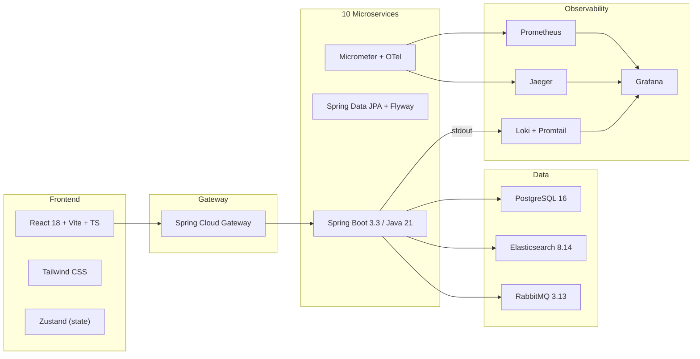

# n11 Clone -- Developer Documentation

Welcome to the developer documentation for the **n11 Clone** project -- a microservices-based e-commerce platform built with Spring Boot 3.3, Java 21, React, and a full observability stack. This system demonstrates production-grade patterns including choreography-based sagas, distributed tracing, centralized logging, and faceted full-text search with Elasticsearch.

---

## What Is This Project?

A Turkish e-commerce clone (inspired by [n11.com](https://www.n11.com)) composed of **10 independently deployable Spring Boot microservices**, a Spring Cloud Gateway, and a React + Vite + Tailwind frontend. Services communicate asynchronously through RabbitMQ using the saga choreography pattern for distributed transactions (user registration, checkout with inventory reservation and payment). The platform ships with a complete three-pillar observability stack (Prometheus metrics, Jaeger traces, Loki logs) unified in Grafana, and an Elasticsearch-backed faceted search engine with Turkish language support.

---

## Documentation Map

| Document | Description |
|----------|-------------|
| [Architecture](architecture.md) | High-level system design, service topology, Docker network, request flow |
| [Authentication & Security](authentication.md) | JWT access tokens, HttpOnly cookie refresh tokens, rate limiting, CORS |
| [Saga Patterns](saga-patterns.md) | UserRegistrationSaga, CheckoutSaga, RabbitMQ topology, event contracts |
| [Observability](observability.md) | Metrics, traces, logs -- data flow, PromQL/LogQL examples, Grafana dashboards |
| [API Reference](api-reference.md) | All endpoints across all services with request/response schemas |
| [Data Model](data-model.md) | ER diagrams, entity relationships, Flyway migrations, ES document mapping |
| [Development Guide](development-guide.md) | Local setup, project structure, how to add services/endpoints/events |
| [Testing](testing.md) | Unit tests, integration tests, mocking strategies, CI pipeline |
| [Deployment & Operations](deployment.md) | Docker Compose topology, multi-stage builds, port config, troubleshooting |

---

## Quick Links

**Run the project:**

```bash
./setup-ports.sh        # auto-discover free ports
docker compose up --build
```

**Default URLs (after startup):**

| URL | What |
|-----|------|
| `http://localhost:13000` | React frontend |
| `http://localhost:18000` | API Gateway |
| `http://localhost:18000/swagger-ui.html` | Swagger UI (auth-service) |
| `http://localhost:13001` | Grafana dashboards |
| `http://localhost:26686` | Jaeger trace UI |
| `http://localhost:25672` | RabbitMQ management (`guest`/`guest`) |

**Demo accounts:**

| Email | Password | Purpose |
|-------|----------|---------|
| `admin@n11demo.com` | `Admin123!` | Admin role access |
| `user@n11demo.com` | `User123!` | Happy-path checkout |
| `failuser@n11demo.com` | `User123!` | Payment failure compensation path |

---

## Tech Stack at a Glance



---

## Repository Structure

```
JwtJava/
  docker-compose.yml          # Full stack definition (19 containers)
  setup-ports.sh              # Auto port discovery script
  frontend/                   # React + Vite + TypeScript + Tailwind
  services/
    api-gateway/              # Spring Cloud Gateway (port 8000)
    auth-service/             # Authentication + JWT (port 8080)
    basket-service/           # Shopping cart (port 8081)
    product-service/          # Product catalog (port 8082)
    order-service/            # Orders + checkout saga (port 8083)
    payment-service/          # Payment processing (port 8084)
    notification-service/     # In-app notifications (port 8085)
    review-service/           # Product reviews (port 8086)
    search-service/           # Elasticsearch search (port 8087)
    inventory-service/        # Stock management (port 8088)
  infra/
    prometheus/               # prometheus.yml scrape config
    grafana/                  # Dashboards + datasource provisioning
    loki/                     # Loki storage config
    promtail/                 # Log collection pipeline config
```

---

## Contributing

1. Read the [Development Guide](development-guide.md) for local setup and conventions.
2. Read the [Testing](testing.md) doc to understand how to write and run tests.
3. Follow the commit convention: one atomic commit per feature, Conventional Commits prefix (`feat:`, `fix:`, `refactor:`, etc.).
