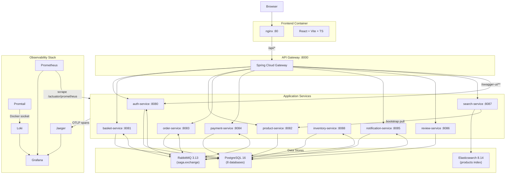
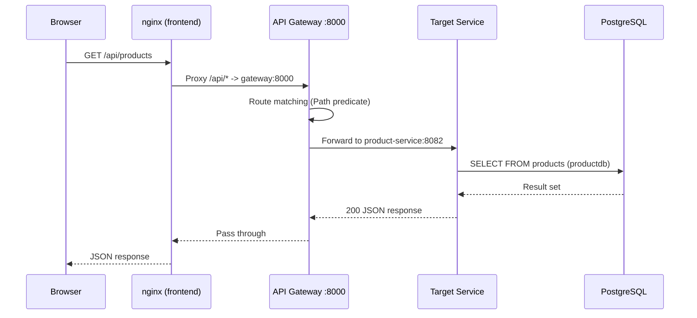
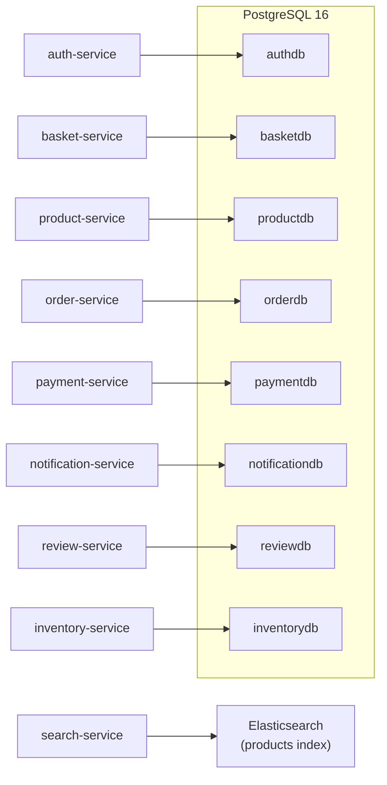
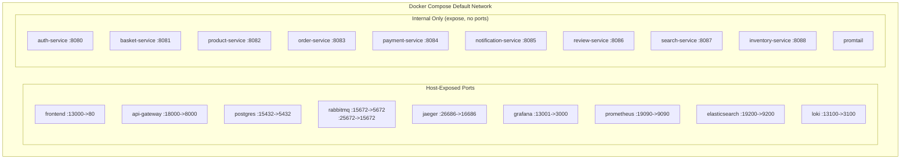
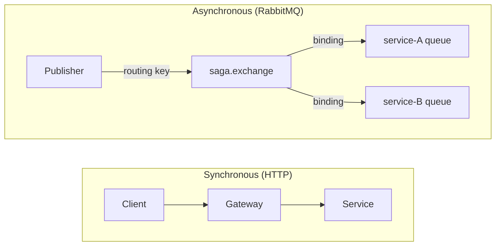
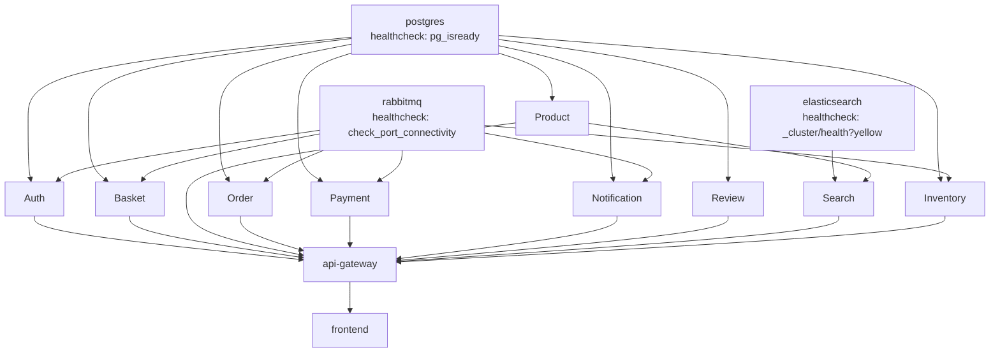

# System Architecture

This document describes the high-level architecture of the n11 Clone platform: how services are organized, how requests flow through the system, and how the Docker network topology is structured.

---

## High-Level Service Topology

The platform consists of **10 Spring Boot microservices**, a Spring Cloud Gateway, a React frontend served by nginx, and shared infrastructure (PostgreSQL, RabbitMQ, Elasticsearch, and the observability stack).

---

## Request Flow

Every external request follows this path:

### Key points about the request flow:

1. **Browser to nginx** -- The React SPA is served as static files. All `/api/*` requests are reverse-proxied to the gateway. This eliminates CORS preflight in production because the browser sees the same origin for both the SPA and the API.

2. **nginx to Gateway** -- Spring Cloud Gateway matches the path against its route table (defined in `api-gateway/src/main/resources/application.yml`). Each route has a `Path` predicate that forwards to the correct service.

3. **Gateway to Service** -- The gateway uses Docker Compose DNS resolution. Service names like `auth-service`, `basket-service`, etc. resolve to the container IP addresses automatically within the Docker network.

4. **Service to Database** -- Each service connects to its own logical database within the shared PostgreSQL instance. Connection URLs follow the pattern `jdbc:postgresql://postgres:5432/{service}db`.

---

## Gateway Route Table

The API Gateway routes are purely path-based with no authentication logic at the gateway layer. Authentication is handled by each service's `JwtAuthFilter`.

| Route ID | Path Predicate | Target URI |
|----------|---------------|------------|
| `auth-service` | `/api/auth/**`, `/api/users/**` | `http://auth-service:8080` |
| `basket-service` | `/api/basket/**` | `http://basket-service:8081` |
| `product-service` | `/api/products/**` | `http://product-service:8082` |
| `order-service` | `/api/orders/**` | `http://order-service:8083` |
| `payment-service` | `/api/payments/**` | `http://payment-service:8084` |
| `notification-service` | `/api/notifications/**` | `http://notification-service:8085` |
| `review-service` | `/api/reviews/**` | `http://review-service:8086` |
| `search-service` | `/api/search/**` | `http://search-service:8087` |
| `auth-swagger` | `/swagger-ui/**`, `/v3/api-docs/**` | `http://auth-service:8080` |

Note: `inventory-service` has no gateway route. It is a purely event-driven service that only communicates via RabbitMQ. Its REST endpoints (`/api/inventory`) are for internal/debugging use only.

---

## Database-per-Service Pattern

Each service owns its data exclusively. No service queries another service's database directly. This is enforced by using separate logical databases within a single PostgreSQL instance.

### Why a single PostgreSQL instance?

For a demo/portfolio project, running 8 separate PostgreSQL containers would consume unnecessary resources. The databases are logically isolated -- each service uses a dedicated JDBC URL (`jdbc:postgresql://postgres:5432/{service}db`), and there are no cross-database queries or foreign keys.

In a production environment, each database would typically run on its own instance (or managed service like RDS) to allow independent scaling and failure isolation.

### Elasticsearch as a read store

`search-service` does not use PostgreSQL at all. It reads from an Elasticsearch `products` index that is populated at startup by pulling the full catalog from `product-service` via HTTP (`ProductIndexer`). This is a CQRS-like pattern: `product-service` is the write side (source of truth), and `search-service` provides an optimized read path for full-text search with facets.

---

## Docker Network Topology

All containers live on a single Docker Compose default bridge network. Service discovery is handled entirely by Docker's built-in DNS -- each service name (e.g., `auth-service`, `postgres`, `rabbitmq`) resolves to the container's IP address.

### Key networking decisions:

- **Services use `expose`, not `ports`** -- Application services only expose their port to the Docker network (via `expose:`), not to the host machine. The only entry point for external traffic is the `api-gateway` (`:18000`) and `frontend` (`:13000`).

- **Infrastructure has host ports for development** -- PostgreSQL, RabbitMQ, Elasticsearch, Jaeger, Grafana, and Prometheus are all mapped to host ports for debugging and development. These ports are offset from defaults (e.g., `15432` instead of `5432`) to avoid conflicts with locally installed services.

- **`setup-ports.sh` handles port conflicts** -- If any default port is already in use, the script finds a free port and writes it to `.env`, which Docker Compose reads automatically.

---

## Service Communication Patterns

Services communicate through two mechanisms:

### 1. Synchronous HTTP (via Gateway)

Used for client-facing request/response interactions. The frontend sends requests through the gateway, which routes them to the appropriate service.

### 2. Asynchronous Messaging (RabbitMQ)

Used for saga choreography and event-driven side effects. Services publish and consume events through a single topic exchange (`saga.exchange`). Each service declares its own queue(s) bound to specific routing keys.

### Which services use RabbitMQ?

| Service | Publishes | Consumes |
|---------|-----------|----------|
| auth-service | `user.registered` | `basket.creation.failed` |
| basket-service | `basket.creation.failed` | `user.registered`, `order.confirmed` |
| order-service | `order.created`, `order.confirmed`, `order.cancelled` | `payment.succeeded`, `payment.failed`, `inventory.out-of-stock` |
| payment-service | `payment.succeeded`, `payment.failed` | `inventory.reserved` |
| notification-service | -- | `user.registered`, `order.confirmed`, `order.cancelled` |
| inventory-service | `inventory.reserved`, `inventory.out-of-stock` | `order.created`, `order.cancelled` |
| product-service | -- | -- |
| review-service | -- | -- |
| search-service | -- | -- |

`product-service`, `review-service`, and `search-service` are purely synchronous today. A future enhancement could have `product-service` publish CRUD events that `search-service` consumes for real-time index updates.

---

## Startup Order and Health Checks

Docker Compose uses `depends_on` with `condition: service_healthy` to enforce a correct startup order. Each service defines a health check:

The full cold-start sequence takes approximately 1-2 minutes, dominated by Elasticsearch reaching `yellow` cluster status and the search-service bootstrapping its product index.

---

## Cross-Cutting Concerns

Every Spring Boot service in the project shares these patterns:

| Concern | Implementation |
|---------|---------------|
| Error handling | `GlobalExceptionHandler` returning RFC 7807 `ProblemDetail` |
| Request logging | `RequestLoggingFilter` with `correlationId` + `traceId` in MDC |
| JWT authentication | `JwtAuthFilter` extracting roles from token (no DB call) |
| Database migrations | Flyway with versioned SQL files (`V{n}__*.sql`) |
| Audit fields | `BaseEntity` with `createdAt`/`updatedAt` via JPA auditing |
| Metrics | Micrometer + Prometheus registry at `/actuator/prometheus` |
| Tracing | OpenTelemetry OTLP exporter to Jaeger |
| Docker image | Multi-stage build with `eclipse-temurin:21-jre-alpine`, non-root `appuser` |

For details on each of these, see the respective documentation pages.
