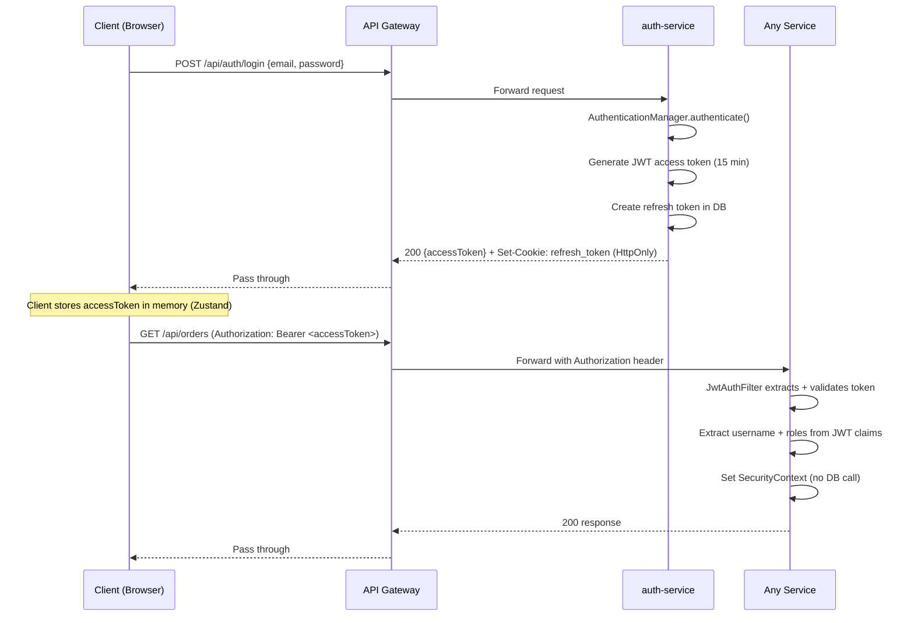
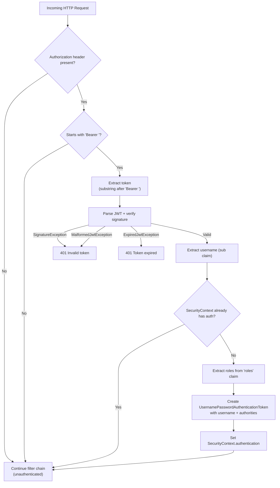

# Authentication & Security

This document covers the JWT-based authentication system, refresh token rotation via HttpOnly cookies, the filter pipeline, rate limiting, password policy, and CORS configuration.

---

## Overview

Authentication is handled by `auth-service` and enforced independently by each downstream service. The system uses:

- **JWT access tokens** (short-lived, 15 minutes) carried in the `Authorization: Bearer` header
- **Opaque refresh tokens** (long-lived, 7 days) stored in the database and delivered as `HttpOnly` cookies
- **Stateless authentication** in all services -- roles are extracted from the JWT itself, no database call required
- **Token rotation** on every refresh, with reuse detection

---

## JWT Access Token Flow



### Access Token Structure

The JWT contains:

| Claim | Description |
|-------|-------------|
| `sub` | User email (used as username) |
| `roles` | Array of role strings, e.g., `["ROLE_USER", "ROLE_ADMIN"]` |
| `iat` | Issued-at timestamp |
| `exp` | Expiration timestamp (15 minutes from issuance) |

The token is signed with HMAC-SHA256 using a shared secret (`jwt.secret` / `JWT_SECRET` env var). All services that need to validate tokens share this secret.

---

## HttpOnly Cookie Refresh Token Flow

Refresh tokens are **never exposed to JavaScript**. They travel exclusively as `HttpOnly` cookies, which protects against XSS token theft.

```mermaid
sequenceDiagram
    participant C as Client (Browser)
    participant G as API Gateway
    participant A as auth-service
    participant DB as authdb

    Note over C: Login
    C->>G: POST /api/auth/login {email, password}
    G->>A: Forward
    A->>DB: Validate credentials
    A->>DB: INSERT refresh_token (token=UUID, user_id, expires_at)
    A-->>C: 200 {accessToken} + Set-Cookie: refresh_token=<UUID>; HttpOnly; Path=/api/auth

    Note over C: Access token expires after 15 min

    C->>G: GET /api/orders (Authorization: Bearer <expired>)
    G->>A: Forward
    A-->>C: 401 "Access token expired"

    Note over C: Frontend detects 401, calls refresh

    C->>G: POST /api/auth/refresh (Cookie: refresh_token=<UUID>)
    G->>A: Forward (cookie included)
    A->>DB: SELECT refresh_token WHERE token=<UUID>
    A->>A: Validate: not expired, not revoked
    A->>DB: UPDATE refresh_token SET revoked=true (old token)
    A->>DB: INSERT new refresh_token (new UUID)
    A->>A: Generate new access token
    A-->>C: 200 {accessToken} + Set-Cookie: refresh_token=<new UUID>

    Note over C: Client retries original request with new access token

    C->>G: GET /api/orders (Authorization: Bearer <new>)
    G-->>C: 200 orders data
```

### Cookie Properties

| Property | Value | Purpose |
|----------|-------|---------|
| Name | `refresh_token` | Identifier |
| HttpOnly | `true` | Prevent JavaScript access (XSS protection) |
| Secure | `false` (demo) | Set to `true` in production (HTTPS only) |
| Path | `/api/auth` | Cookie only sent to auth endpoints |
| Max-Age | `604800` (7 days) | Matches refresh token DB expiry |
| SameSite | `Lax` (browser default) | CSRF protection |

The frontend uses `credentials: 'include'` on all `fetch` calls so the browser sends the cookie automatically to `/api/auth/*` endpoints.

---

## Token Rotation and Reuse Detection

Every call to `POST /api/auth/refresh` performs a **rotation**:

1. The current refresh token is looked up in the database
2. It is marked as `revoked = true` (but not deleted)
3. A new refresh token is created for the same user
4. Both a new access token and new refresh token cookie are returned

**Reuse detection**: If a revoked token is presented for refresh, the request fails with a 401. This detects a scenario where an attacker captured and replayed a refresh token after the legitimate user already rotated it. The `RefreshToken` entity retains revoked tokens specifically for this purpose:

```java
@Entity
@Table(name = "refresh_tokens")
public class RefreshToken extends BaseEntity {
    private Long id;
    private String token;          // UUID string
    @ManyToOne
    private User user;             // Many tokens per user allowed
    private Instant expiresAt;
    private boolean revoked;       // false -> true on rotation

    public boolean isExpired() {
        return Instant.now().isAfter(expiresAt);
    }
}
```

The `@ManyToOne` relationship to `User` allows multiple active tokens per user (e.g., logged in on multiple devices).

---

## JwtAuthFilter Pipeline

Every authenticated service runs `JwtAuthFilter` as a Spring Security filter inserted before `UsernamePasswordAuthenticationFilter`. Here is the complete decision flow:



### Key design decisions:

1. **No database call** -- Roles are stored in the JWT itself (`roles` claim), so the filter never hits the database. This makes authentication fully stateless and allows any service with the shared secret to authenticate requests.

2. **Extends `OncePerRequestFilter`** -- Guarantees the filter executes exactly once per request, even with request dispatching.

3. **Error handling in the filter** -- JWT parsing errors (expired, malformed, bad signature) are caught and return `401` directly, before reaching the controller layer.

---

## SecurityConfig

The `SecurityConfig` class in each service defines which endpoints are public and which require authentication.

### auth-service SecurityConfig

```java
.authorizeHttpRequests(auth -> auth
    .requestMatchers("/api/auth/**").permitAll()
    .requestMatchers("/actuator/health", "/actuator/info", "/actuator/prometheus").permitAll()
    .requestMatchers("/swagger-ui/**", "/swagger-ui.html", "/v3/api-docs/**").permitAll()
    .anyRequest().authenticated()
)
.sessionManagement(session ->
    session.sessionCreationPolicy(SessionCreationPolicy.STATELESS)
)
```

| Endpoint Pattern | Access |
|-----------------|--------|
| `/api/auth/**` | Public -- registration, login, refresh, logout |
| `/actuator/health`, `/actuator/info`, `/actuator/prometheus` | Public -- health checks and Prometheus scraping |
| `/swagger-ui/**`, `/v3/api-docs/**` | Public -- API documentation |
| Everything else | Authenticated (valid JWT required) |

### Other services

All other services (basket, order, payment, notification, review) follow the same pattern:
- Actuator endpoints are public (for Prometheus)
- All `/api/*` endpoints require authentication
- `product-service` and `search-service` have their catalog/search endpoints as public (no JWT required)

### Method-level security

`@EnableMethodSecurity` is active on auth-service, allowing `@PreAuthorize` annotations:

```java
@GetMapping("/admin")
@PreAuthorize("hasRole('ADMIN')")
public ResponseEntity<Map<String, String>> adminOnly() { ... }
```

---

## Password Validation Rules

Registration passwords are validated by the custom `@StrongPassword` annotation backed by `StrongPasswordValidator`:

| Rule | Regex / Check |
|------|--------------|
| Minimum length | 8 characters |
| Uppercase letter | `[A-Z]` |
| Lowercase letter | `[a-z]` |
| Digit | `[0-9]` |
| Special character | `[^a-zA-Z0-9]` |

Invalid passwords produce an RFC 7807 error with field-level details:

```json
{
  "type": "about:blank",
  "status": 400,
  "title": "Bad Request",
  "detail": "Validation error",
  "instance": "/api/auth/register",
  "timestamp": "2026-04-22T10:00:00Z",
  "fields": {
    "password": "Sifre en az 8 karakter olmali ve buyuk harf, kucuk harf, rakam ve ozel karakter icermelidir."
  }
}
```

---

## Rate Limiting (Bucket4j)

The `RateLimitFilter` protects authentication endpoints from brute-force attacks using the Bucket4j token bucket algorithm.

### Configuration

| Parameter | Value |
|-----------|-------|
| Scope | `/api/auth/**` only |
| Capacity | 10 requests per IP |
| Refill | Greedy refill of 10 tokens per minute |
| Key | Client IP (from `X-Forwarded-For` or `remoteAddr`) |

### How it works

```mermaid
flowchart TD
    A["Request to /api/auth/*"] --> B["Resolve client IP"]
    B --> C["Lookup or create Bucket for IP"]
    C --> D{tryConsume(1) succeeds?}
    D -->|Yes| E["Continue to next filter"]
    D -->|No| F["Return 429 Too Many Requests"]
    F --> G["Set Retry-After header"]
    F --> H["RFC 7807 ProblemDetail response"]
```

The 429 response includes:

```json
{
  "type": "about:blank",
  "status": 429,
  "detail": "Too many requests. Please wait 1 minute.",
  "instance": "/api/auth/login",
  "timestamp": "2026-04-22T10:00:00Z",
  "retryAfterSeconds": 60
}
```

### Filter ordering

Filters execute in this order on auth-service:

1. `RequestLoggingFilter` (`@Order(1)`) -- assigns correlationId, logs request/response
2. `RateLimitFilter` -- rate-limits `/api/auth/**`
3. `JwtAuthFilter` -- extracts and validates JWT
4. Spring Security filter chain -- authorization checks

---

## CORS Configuration

CORS is configured at **two layers** to handle both the gateway and individual service scenarios:

### Gateway-level CORS

The API Gateway applies global CORS via Spring Cloud Gateway config:

```yaml
spring.cloud.gateway.globalcors:
  cors-configurations:
    '[/**]':
      allowedOriginPatterns: "*"
      allowedMethods: "*"
      allowedHeaders: "*"
      allowCredentials: true
```

### Service-level CORS (auth-service)

Each service also has its own CORS config for direct access during development:

```java
CorsConfiguration config = new CorsConfiguration();
config.setAllowedOriginPatterns(List.of("*"));
config.setAllowedMethods(List.of("GET", "POST", "PUT", "PATCH", "DELETE", "OPTIONS"));
config.setAllowedHeaders(List.of("Authorization", "Content-Type"));
config.setExposedHeaders(List.of("Authorization"));
config.setAllowCredentials(true);
```

### Why CORS works seamlessly in production

In the Docker deployment, the frontend and API are served from the **same origin** (`localhost:13000`). The nginx config inside the frontend container proxies `/api/*` to the gateway, so the browser sees same-origin requests and never triggers CORS preflight. The CORS headers are only needed during local development when the Vite dev server (`localhost:5173`) and the gateway (`localhost:18000`) are on different ports.

---

## Security Checklist

| Item | Status | Notes |
|------|--------|-------|
| JWT signed with HMAC-SHA256 | Yes | Key must be at least 256 bits |
| Access token short-lived | Yes | 15 minutes (`JWT_ACCESS_TOKEN_EXPIRY`) |
| Refresh token in HttpOnly cookie | Yes | Not accessible to JavaScript |
| Token rotation on refresh | Yes | Old token revoked, new one issued |
| Reuse detection | Yes | Revoked tokens kept, not deleted |
| Password complexity enforcement | Yes | `@StrongPassword` validator |
| Rate limiting on auth endpoints | Yes | 10 req/min per IP (Bucket4j) |
| CSRF disabled | Yes | Stateless JWT auth, no session cookies |
| Stateless sessions | Yes | `SessionCreationPolicy.STATELESS` |
| Service-to-service isolation | Yes | Services expose ports only to Docker network |
| Actuator endpoints secured | Partial | `/actuator/prometheus` is public for scraping |
| Elasticsearch security | No | `xpack.security.enabled=false` for demo |

---

## Environment Variables

| Variable | Default | Description |
|----------|---------|-------------|
| `JWT_SECRET` | Demo key (64 hex chars) | HMAC-SHA256 signing key. **Change in production.** |
| `JWT_ACCESS_TOKEN_EXPIRY` | `900000` (15 min) | Access token lifetime in milliseconds |
| `JWT_REFRESH_TOKEN_EXPIRY` | `604800000` (7 days) | Refresh token lifetime in milliseconds |

All services that validate JWTs must share the same `JWT_SECRET`. In Docker Compose, this is set once and propagated to each service's environment.

---

## Related Documentation

- [API Reference](api-reference.md) -- Full endpoint documentation including auth endpoints
- [Saga Patterns](saga-patterns.md) -- How the `user.registered` event is published after registration
- [Architecture](architecture.md) -- How the gateway routes requests to services
