# Data Model

This document describes the database schema for each service, entity relationships, Flyway migration strategy, audit fields, and the Elasticsearch document mapping.

---

## Database-per-Service Overview

Each service owns its own logical database within a shared PostgreSQL 16 instance. There are no cross-database foreign keys or joins.

| Service | Database | Tables |
|---------|----------|--------|
| auth-service | `authdb` | `users`, `user_roles`, `refresh_tokens` |
| basket-service | `basketdb` | `baskets`, `basket_items` |
| product-service | `productdb` | `products` |
| order-service | `orderdb` | `orders`, `order_items` |
| payment-service | `paymentdb` | `payment_transactions` |
| notification-service | `notificationdb` | `notifications` |
| review-service | `reviewdb` | `reviews` |
| inventory-service | `inventorydb` | `inventory_items`, `reservations` |
| search-service | -- | Elasticsearch `products` index (no SQL) |

---

## auth-service (authdb)

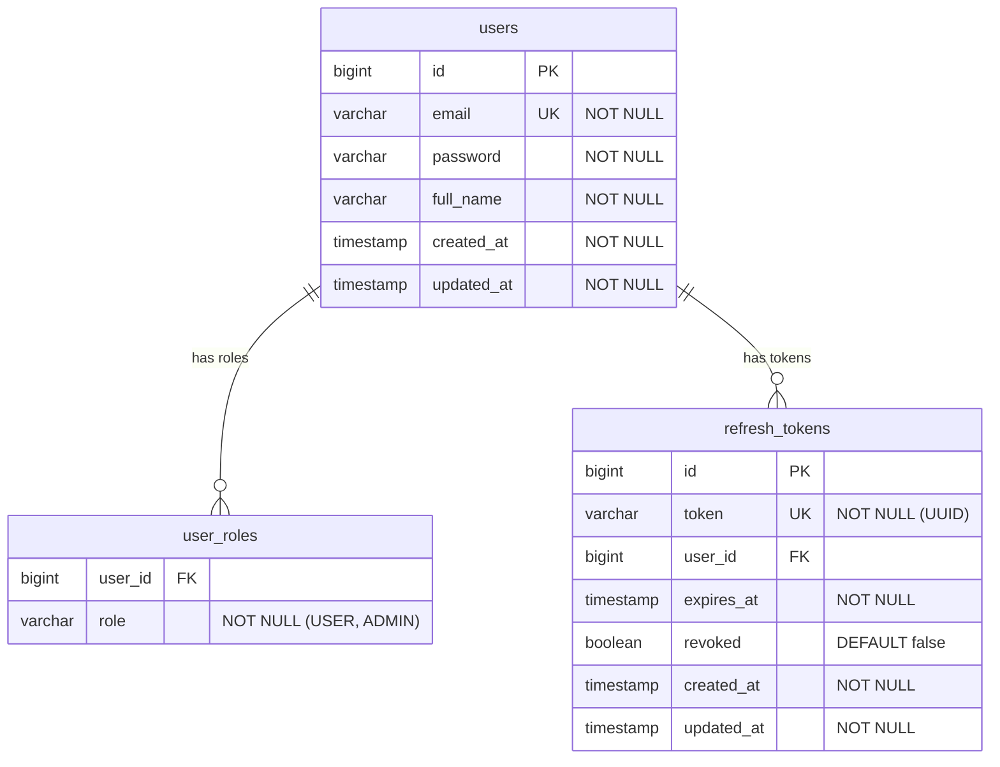

### Key Design Decisions

- **user_roles** is a collection table (`@ElementCollection`) rather than a separate entity. Roles are stored as enum strings (`USER`, `ADMIN`).
- **refresh_tokens** has a `@ManyToOne` relationship to `users`, allowing multiple active tokens per user (multi-device support).
- **revoked** tokens are not deleted -- they are kept for reuse detection. A revoked token presented for refresh indicates a potential token theft.
- The `email` column serves as both the login username and the unique identifier used across services (no numeric user IDs are shared between services).

### Migrations

| File | Description |
|------|-------------|
| `V1__create_users_table.sql` | Creates `users` table |
| `V2__create_refresh_tokens_table.sql` | Creates `refresh_tokens` with unique constraint on token |
| `V3__create_user_roles_table.sql` | Creates `user_roles` join table |
| `V4__refresh_tokens_allow_multiple_per_user.sql` | Drops unique constraint on user_id to allow multi-device |

---

## basket-service (basketdb)

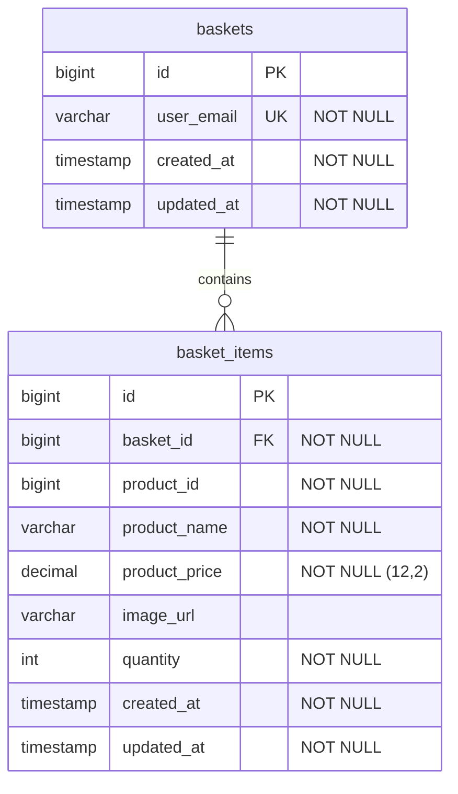

### Key Design Decisions

- **Denormalized product data** -- `product_name`, `product_price`, and `image_url` are copied into the basket item. This avoids a synchronous call to product-service when rendering the cart.
- **One basket per user** -- `user_email` has a unique constraint. The basket is created by the UserRegistrationSaga when the user registers.
- **Quantity merge** -- When adding a product that already exists in the basket, the quantities are merged rather than creating a duplicate row.

### Migrations

| File | Description |
|------|-------------|
| `V1__create_baskets_table.sql` | Creates `baskets` with unique `user_email` |
| `V2__create_basket_items_table.sql` | Creates `basket_items` with FK to baskets |

---

## product-service (productdb)

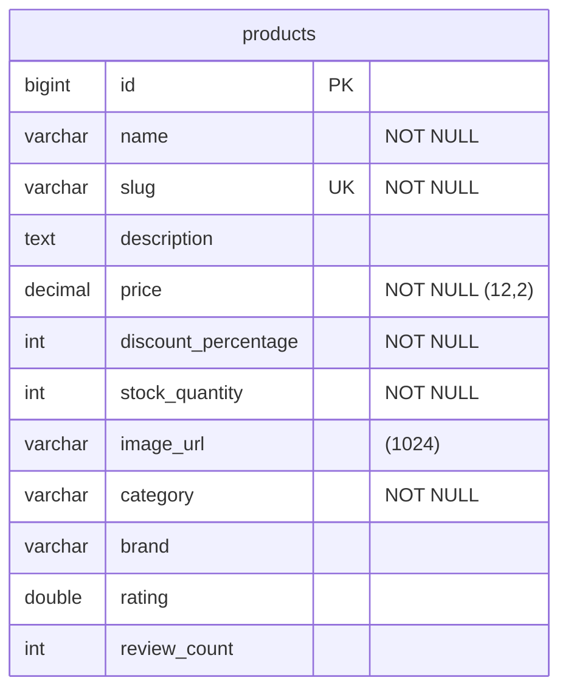

### Key Design Decisions

- **No BaseEntity** -- product-service does not use the `createdAt`/`updatedAt` audit fields. Products are seeded via Flyway migration.
- **slug** is a unique, URL-friendly identifier used in the frontend for clean URLs (`/product/samsung-galaxy-s24`).
- **discountedPrice** is computed server-side (not stored) as `price * (1 - discountPercentage / 100)` and included in API responses.
- **rating** and **review_count** are denormalized from review-service for display purposes. In a production system, these would be updated via events.

### Migrations

| File | Description |
|------|-------------|
| `V1__create_products_table.sql` | Creates `products` table with all columns |
| `V2__seed_products.sql` | Seeds the product catalog (48 products across 8 categories) |

---

## order-service (orderdb)

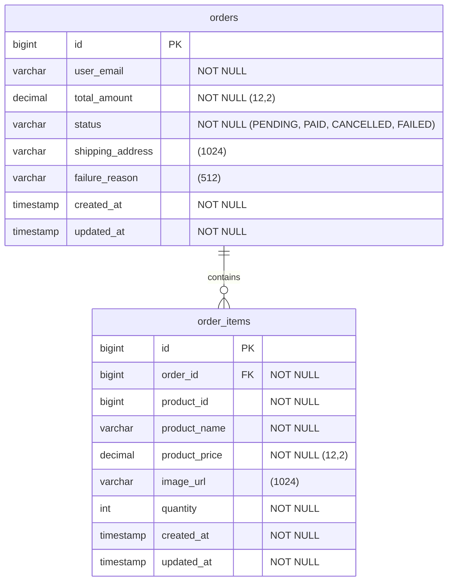

### Order Status Transitions

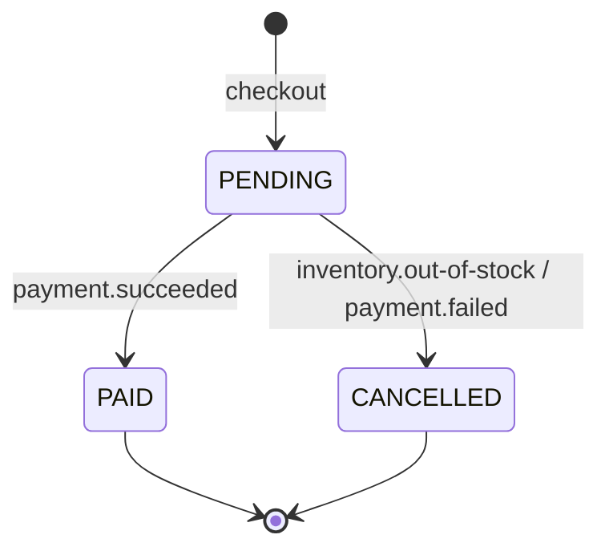

### Key Design Decisions

- **total_amount** is computed server-side from the item prices and quantities during checkout. The client-submitted prices are trusted but verified.
- **failure_reason** is populated when an order is cancelled, describing what went wrong (e.g., "Stok yetersiz" or "Payment declined").
- **Denormalized item data** -- Same pattern as basket: product name, price, and image are snapshotted at checkout time.

### Migrations

| File | Description |
|------|-------------|
| `V1__create_orders.sql` | Creates `orders` and `order_items` tables |

---

## payment-service (paymentdb)

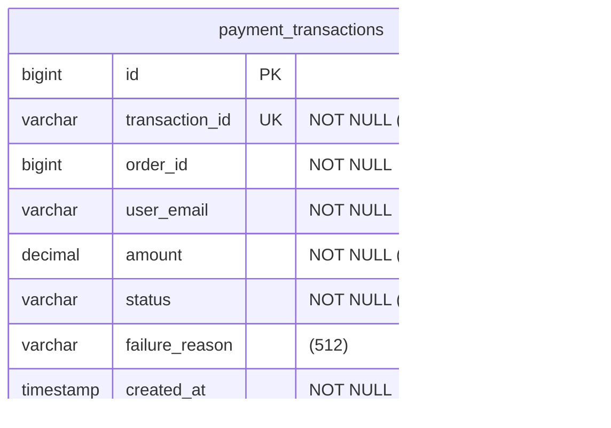

### Key Design Decisions

- **transaction_id** is a system-generated UUID string (e.g., `txn_a1b2c3d4`), distinct from the database primary key.
- **No BaseEntity** -- uses only `@CreatedDate` (no `updatedAt`) because payment records are immutable once created.
- **No update** -- payment records are write-once. The status is determined at creation time by the mock payment processor.

### Payment Status Values

| Status | Meaning |
|--------|---------|
| `SUCCEEDED` | Payment accepted |
| `FAILED` | Payment declined (with reason) |

### Migrations

| File | Description |
|------|-------------|
| `V1__create_payments.sql` | Creates `payment_transactions` table |

---

## notification-service (notificationdb)

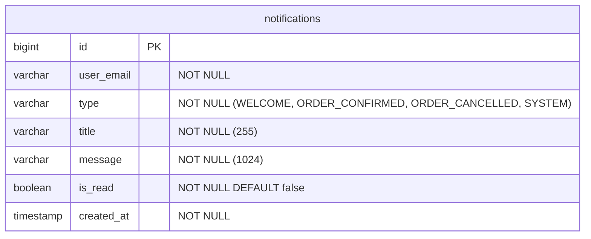

### Key Design Decisions

- **Append-only** -- Notifications are created by saga event consumers and only updated to mark as read.
- **No BaseEntity** -- uses only `@CreatedDate`.
- **Type enum** determines the icon and color in the frontend notification bell.

### Notification Type Mapping

| Saga Event | Notification Type | Example Title |
|------------|------------------|---------------|
| `user.registered` | `WELCOME` | "Hos geldin!" |
| `order.confirmed` | `ORDER_CONFIRMED` | "Siparisin onaylandi" |
| `order.cancelled` | `ORDER_CANCELLED` | "Siparisin iptal edildi" |

### Migrations

| File | Description |
|------|-------------|
| `V1__create_notifications.sql` | Creates `notifications` table |

---

## review-service (reviewdb)

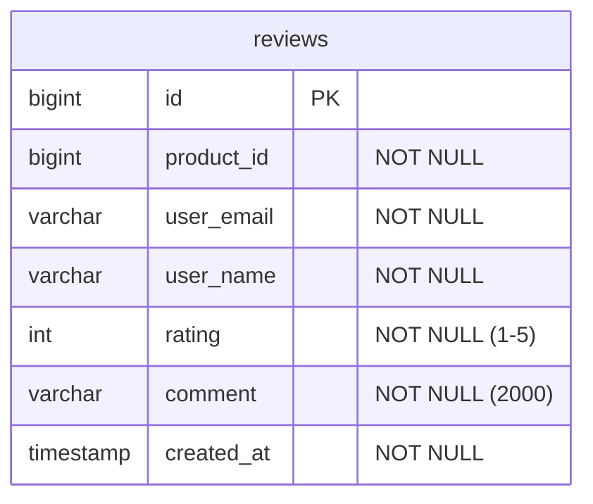

### Key Design Decisions

- **Unique constraint** on `(product_id, user_email)` -- one review per user per product.
- **user_name** is derived from the email (part before `@`, capitalized) at creation time. Stored denormalized to avoid calling auth-service.
- **No BaseEntity** -- uses only `@CreatedDate`.

### Migrations

| File | Description |
|------|-------------|
| `V1__create_reviews.sql` | Creates `reviews` table with unique constraint |
| `V2__seed_reviews.sql` | Seeds 21 sample reviews across selected products |

---

## inventory-service (inventorydb)

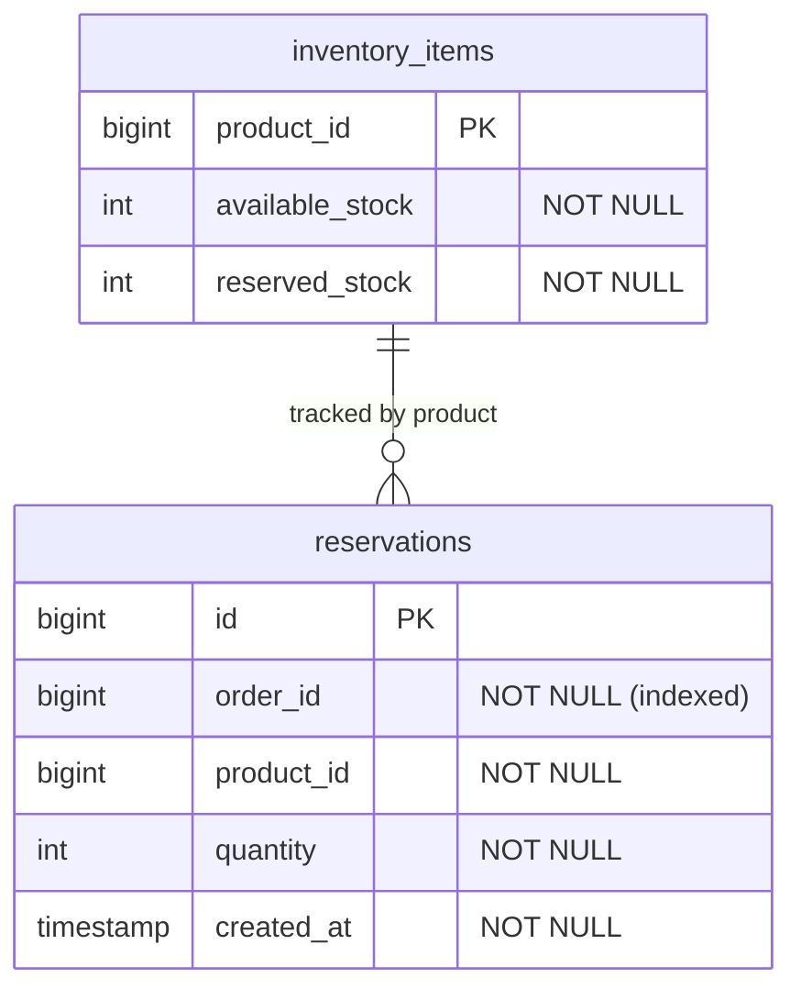

### Stock Lifecycle

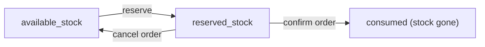

When an order is created:
- `available_stock -= quantity` and `reserved_stock += quantity` (per product line)
- A `reservations` row is inserted per line item (for tracking which order reserved what)

When an order is cancelled:
- `reserved_stock -= quantity` and `available_stock += quantity` (restoring stock)
- Reservation rows are deleted
- This operation is **idempotent**: if no reservations exist for the orderId, it is a no-op

### Key Design Decisions

- **product_id is the PK** of `inventory_items` -- there is exactly one inventory record per product.
- **Separate from product-service** -- inventory state changes rapidly during sagas. Keeping it in a separate service and database avoids contention with the product catalog.
- **All-or-nothing reservation** -- If any line item in an order cannot be reserved, the entire reservation fails and nothing is reserved. This prevents partial reservations.

### Migrations

| File | Description |
|------|-------------|
| `V1__create_inventory.sql` | Creates `inventory_items` and `reservations` tables |
| `V2__seed_initial_stock.sql` | Seeds initial stock quantities for all products |

---

## BaseEntity (Audit Fields)

Most services extend a `BaseEntity` mapped superclass that provides automatic audit timestamps via JPA auditing (`@EnableJpaAuditing`):

```java
@MappedSuperclass
@EntityListeners(AuditingEntityListener.class)
@Getter
public abstract class BaseEntity {
    @CreatedDate
    @Column(nullable = false, updatable = false)
    private Instant createdAt;

    @LastModifiedDate
    @Column(nullable = false)
    private Instant updatedAt;
}
```

**Services using BaseEntity:** auth-service (User, RefreshToken), basket-service (Basket, BasketItem), order-service (Order, OrderItem)

**Services using only @CreatedDate:** payment-service, notification-service, review-service, inventory-service (Reservation)

**Services with no audit fields:** product-service (seeded data), inventory-service (InventoryItem -- only stock counters)

---

## Flyway Migration Strategy

### Convention

- All migrations live in `src/main/resources/db/migration/`
- Files are named `V{version}__{description}.sql` (double underscore)
- Version numbers are sequential integers per service
- Schema changes are always additive (new migration file, never edit existing ones)
- Flyway runs automatically on application startup

### Migration Inventory

| Service | V1 | V2 | V3 | V4 |
|---------|-----|-----|-----|-----|
| auth | Create users | Create refresh_tokens | Create user_roles | Allow multiple refresh tokens per user |
| basket | Create baskets | Create basket_items | -- | -- |
| product | Create products | Seed products | -- | -- |
| order | Create orders + order_items | -- | -- | -- |
| payment | Create payment_transactions | -- | -- | -- |
| notification | Create notifications | -- | -- | -- |
| review | Create reviews | Seed reviews | -- | -- |
| inventory | Create inventory + reservations | Seed initial stock | -- | -- |

---

## Elasticsearch Product Document Mapping

`search-service` uses Spring Data Elasticsearch with `@Document` annotations. The index is named `products`.

```mermaid
graph LR
    subgraph ProductDocument["products (ES index)"]
        id["id: Long (keyword, _id)"]
        name["name: Text (turkish analyzer)"]
        slug["slug: Keyword"]
        description["description: Text (turkish analyzer)"]
        category["category: Keyword"]
        brand["brand: Keyword"]
        price["price: Double"]
        discountedPrice["discountedPrice: Double"]
        discountPercentage["discountPercentage: Integer"]
        stockQuantity["stockQuantity: Integer"]
        imageUrl["imageUrl: Keyword"]
        rating["rating: Double"]
        reviewCount["reviewCount: Integer"]
    end
```

### Field Type Reference

| Field | ES Type | Analyzer | Purpose |
|-------|---------|----------|---------|
| `id` | `_id` (Long) | -- | Document ID, same as product-service PK |
| `name` | `text` | `turkish` | Full-text search with Turkish stemming |
| `slug` | `keyword` | -- | Exact match, used for frontend URLs |
| `description` | `text` | `turkish` | Full-text search body |
| `category` | `keyword` | -- | Exact match filter + aggregation |
| `brand` | `keyword` | -- | Exact match filter + aggregation |
| `price` | `double` | -- | Original price |
| `discountedPrice` | `double` | -- | Range filter + sort |
| `discountPercentage` | `integer` | -- | Display |
| `stockQuantity` | `integer` | -- | Display |
| `imageUrl` | `keyword` | -- | Display |
| `rating` | `double` | -- | Range filter + sort |
| `reviewCount` | `integer` | -- | Display |

### Turkish Analyzer

The built-in `turkish` analyzer provides:
- **Tokenization** -- splits text on whitespace and punctuation
- **Lowercasing** -- Turkish-aware (handles dotted/dotless I correctly)
- **Stemming** -- `telefonlar` -> `telefon`, `bilgisayarlarin` -> `bilgisayar`
- **Diacritics** -- normalizes Turkish special characters (c, g, i, o, s, u)

### Search Query Structure

The search endpoint builds an Elasticsearch query with:

1. **multi_match** on `name^3`, `brand^2`, `description` with `fuzziness: AUTO`
2. **term filters** for `category`, `brand` (keyword fields)
3. **range filter** on `discountedPrice` for min/max price
4. **range filter** on `rating` for min rating
5. **Aggregations** for facets: `brands` (terms), `categories` (terms), `price` (min/max)
6. **Sort** by `_score` (relevance), `discountedPrice` (asc/desc), or `rating` (desc)

### Index Synchronization

The `ProductIndexer` class pulls products from `product-service` via HTTP at startup and bulk-indexes them into Elasticsearch. `POST /api/search/reindex` triggers a manual re-sync.

This is a pull-based reconciliation strategy suitable for demo purposes. In production, it would be replaced with event-driven indexing via RabbitMQ (`product.created`, `product.updated`, `product.deleted` events).

---

## Related Documentation

- [API Reference](api-reference.md) -- Endpoint schemas that map to these entities
- [Saga Patterns](saga-patterns.md) -- How events reference entity fields
- [Development Guide](development-guide.md) -- How to add new entities and migrations
