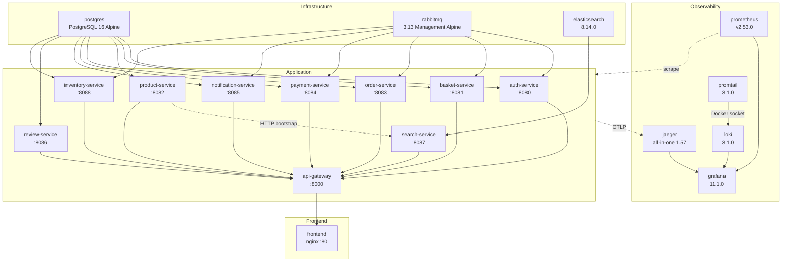
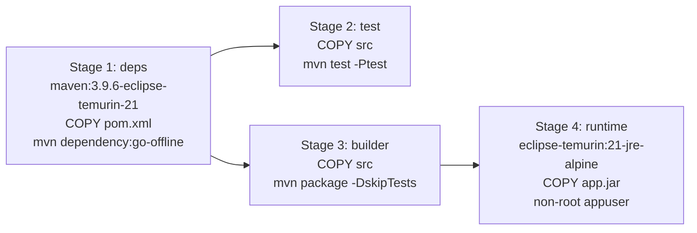
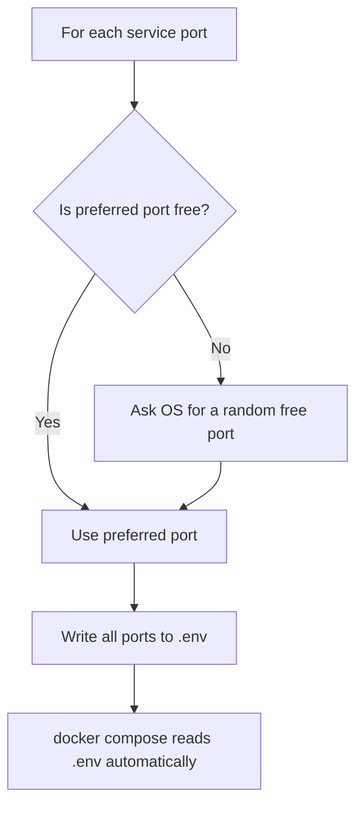
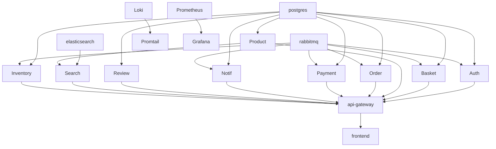

# Deployment & Operations

This document covers the Docker Compose topology, multi-stage Dockerfile, port configuration, health checks, startup order, memory tuning, scaling considerations, and common troubleshooting scenarios.

---

## Docker Compose Topology

The entire platform runs as 19 containers defined in a single `docker-compose.yml`:



### Container Summary

| Container | Image | Host Port | Internal Port | Volumes |
|-----------|-------|-----------|---------------|---------|
| `n11-postgres` | `postgres:16-alpine` | `15432` | `5432` | `postgres_data` |
| `n11-rabbitmq` | `rabbitmq:3.13-management-alpine` | `15672`/`25672` | `5672`/`15672` | -- |
| `n11-elasticsearch` | `elasticsearch:8.14.0` | `19200` | `9200` | `elasticsearch_data` |
| `n11-jaeger` | `jaegertracing/all-in-one:1.57` | `26686`/`14317`/`14318` | `16686`/`4317`/`4318` | -- |
| `n11-loki` | `grafana/loki:3.1.0` | `13100` | `3100` | `loki_data` |
| `n11-promtail` | `grafana/promtail:3.1.0` | -- | `9080` | Docker socket (ro) |
| `n11-prometheus` | `prom/prometheus:v2.53.0` | `19090` | `9090` | `prometheus_data` |
| `n11-grafana` | `grafana/grafana:11.1.0` | `13001` | `3000` | `grafana_data` |
| `n11-auth` | Built from `./services/auth-service` | -- | `8080` | -- |
| `n11-basket` | Built from `./services/basket-service` | -- | `8081` | -- |
| `n11-product` | Built from `./services/product-service` | -- | `8082` | -- |
| `n11-order` | Built from `./services/order-service` | -- | `8083` | -- |
| `n11-payment` | Built from `./services/payment-service` | -- | `8084` | -- |
| `n11-notification` | Built from `./services/notification-service` | -- | `8085` | -- |
| `n11-review` | Built from `./services/review-service` | -- | `8086` | -- |
| `n11-search` | Built from `./services/search-service` | -- | `8087` | -- |
| `n11-inventory` | Built from `./services/inventory-service` | -- | `8088` | -- |
| `n11-gateway` | Built from `./services/api-gateway` | `18000` | `8000` | -- |
| `n11-frontend` | Built from `./frontend` | `13000` | `80` | -- |

### Named Volumes

| Volume | Used By | Purpose |
|--------|---------|---------|
| `postgres_data` | postgres | Persist database across restarts |
| `elasticsearch_data` | elasticsearch | Persist ES index data |
| `prometheus_data` | prometheus | Persist metric history |
| `grafana_data` | grafana | Persist dashboard customizations |
| `loki_data` | loki | Persist log data |

---

## Multi-Stage Dockerfile

Every Spring Boot service uses the same 4-stage Dockerfile pattern:



### Stage Details

| Stage | Base Image | Purpose | Cache Optimization |
|-------|-----------|---------|-------------------|
| `deps` | `maven:3.9.6-eclipse-temurin-21` | Download Maven dependencies | Dependencies layer cached; only invalidated when `pom.xml` changes |
| `test` | Extends `deps` | Run unit tests | Fails the build if any test fails |
| `builder` | Extends `deps` | Build the JAR | Reuses dependency cache from stage 1 |
| `runtime` | `eclipse-temurin:21-jre-alpine` | Run the application | Minimal image (~180MB), JRE only, no build tools |

### Security Hardening

```dockerfile
RUN addgroup -S appgroup && adduser -S appuser -G appgroup
USER appuser
```

The runtime stage creates a non-root user (`appuser`) and switches to it before running the application. This prevents container escape attacks from gaining root access.

### Build Cache Strategy

Docker layer caching makes rebuilds fast:

1. `COPY pom.xml` changes rarely -> dependency layer stays cached
2. `COPY src` changes often -> only test/build stages re-execute
3. Runtime image only copies the final JAR -> small, fast deploys

---

## Port Configuration

### Default Ports

All host ports use non-standard values to avoid conflicts with locally installed services:

| Service | Host Port | Container Port |
|---------|-----------|---------------|
| PostgreSQL | `15432` | `5432` |
| RabbitMQ AMQP | `15672` | `5672` |
| RabbitMQ Management | `25672` | `15672` |
| Jaeger UI | `26686` | `16686` |
| Jaeger OTLP gRPC | `14317` | `4317` |
| Jaeger OTLP HTTP | `14318` | `4318` |
| Loki | `13100` | `3100` |
| Prometheus | `19090` | `9090` |
| Grafana | `13001` | `3000` |
| Elasticsearch | `19200` | `9200` |
| API Gateway | `18000` | `8000` |
| Frontend | `13000` | `80` |

### setup-ports.sh

The `setup-ports.sh` script automatically resolves port conflicts:



How it works:

1. Checks if the preferred port is free using `ss` and `docker ps`
2. If occupied, uses Python to bind to port 0 (OS assigns a free port)
3. Writes all port assignments to `.env`
4. Docker Compose automatically reads `.env` for variable interpolation

```bash
./setup-ports.sh
# Output:
#   PostgreSQL       : 15432
#   RabbitMQ AMQP    : 15672
#   ...
#   Frontend         : 13000
#
# Run: docker compose up -d
```

### Manual Override

Create or edit `.env` manually:

```env
GATEWAY_PORT=9000
FRONTEND_PORT=3000
```

---

## Health Checks and Startup Order

### Health Check Configuration

Every service defines a health check in `docker-compose.yml`:

| Service | Health Check Command | Interval | Retries | Start Period |
|---------|---------------------|----------|---------|-------------|
| PostgreSQL | `pg_isready -U postgres` | 10s | 5 | 10s |
| RabbitMQ | `rabbitmq-diagnostics -q check_port_connectivity` | 10s | 10 | 30s |
| Elasticsearch | `curl _cluster/health?wait_for_status=yellow` | 15s | 10 | 40s |
| Jaeger | `wget http://localhost:14269/` | 10s | 5 | -- |
| Loki | `wget http://localhost:3100/ready` | 10s | 8 | 20s |
| Prometheus | `wget http://localhost:9090/-/ready` | 10s | 5 | -- |
| Grafana | `wget http://localhost:3000/api/health` | 15s | 5 | -- |
| All Spring services | `wget http://localhost:{port}/actuator/health` | 15s | 6 | 40s |

### Startup Dependency Chain



Docker Compose `depends_on` with `condition: service_healthy` ensures:

1. **Infrastructure first**: PostgreSQL, RabbitMQ, Elasticsearch must be healthy
2. **Services next**: All 9 application services start once their dependencies are healthy
3. **Gateway after services**: Waits for all 9 services to be healthy
4. **Frontend last**: Waits for gateway to start

### Cold Start Timeline

| Minute | What's happening |
|--------|-----------------|
| 0:00 | PostgreSQL, RabbitMQ, Elasticsearch starting |
| 0:15 | PostgreSQL healthy, RabbitMQ healthy |
| 0:30 | Elasticsearch reaches `yellow` status |
| 0:40 | Application services starting (Flyway migrations, Spring context) |
| 1:00 | Most services healthy, search-service indexing products |
| 1:15 | Gateway healthy, frontend available |
| 1:30 | Full stack operational |

---

## Memory Tuning

### Elasticsearch

```yaml
ES_JAVA_OPTS: -Xms256m -Xmx256m
```

The default is 256MB heap for demo. For production with large catalogs:
- 2-4 GB heap recommended
- Never set more than 50% of available RAM
- Consider `ES_JAVA_OPTS=-Xms2g -Xmx2g`

### RabbitMQ

```yaml
RABBITMQ_SERVER_ADDITIONAL_ERL_ARGS: "-rabbit vm_memory_high_watermark 0.6"
mem_limit: 512m
```

- `vm_memory_high_watermark 0.6` -- RabbitMQ pauses publishing when it uses 60% of available memory
- `mem_limit: 512m` -- Docker memory limit prevents unbounded growth
- For production: 1-2 GB with higher watermark

### Spring Boot Services

Services use JVM defaults (no explicit `-Xmx`). Each service typically uses 200-400 MB. For the entire stack:

| Component | Approximate Memory |
|-----------|-------------------|
| 10 Spring Boot services | ~3 GB total |
| PostgreSQL | ~200 MB |
| RabbitMQ | ~300 MB (limited to 512m) |
| Elasticsearch | ~400 MB (256m heap + overhead) |
| Jaeger | ~200 MB |
| Loki + Promtail | ~200 MB |
| Prometheus | ~200 MB |
| Grafana | ~150 MB |
| Frontend (nginx) | ~20 MB |
| **Total** | **~5 GB** |

Recommended minimum: **8 GB RAM** on the host machine.

---

## Scaling Considerations

### What Can Scale Horizontally

| Component | How to Scale | Notes |
|-----------|-------------|-------|
| Application services | `docker compose up --scale order-service=3` | RabbitMQ distributes messages across consumers; gateway needs load balancer |
| Frontend | Multiple nginx instances behind LB | Stateless static files |

### What Cannot Scale Easily (Demo Setup)

| Component | Limitation | Production Solution |
|-----------|-----------|-------------------|
| PostgreSQL | Single instance | Managed DB (RDS), read replicas |
| Elasticsearch | Single node | Multi-node cluster |
| Jaeger | In-memory storage | Elasticsearch/Cassandra backend |
| RabbitMQ | Single node | RabbitMQ cluster with quorum queues |
| Gateway | Single instance | Multiple instances behind a load balancer |

### Considerations When Scaling Services

1. **JWT validation is stateless** -- Any instance can validate any token. No session affinity needed.
2. **RabbitMQ consumers** -- Multiple instances of the same service share the same queue. RabbitMQ round-robins messages, ensuring each message is processed once.
3. **Database connections** -- Each instance opens its own connection pool. Monitor HikariCP pool usage with `hikaricp_connections_active`.
4. **Search reindex** -- Only one instance should run the bootstrap indexer. Use a leader election mechanism or run reindex manually.

---

## Environment Variables Reference

### Shared Across Services

| Variable | Default | Description |
|----------|---------|-------------|
| `JWT_SECRET` | Demo key | HMAC-SHA256 signing key (all services must share) |
| `SPRING_DATASOURCE_URL` | Per service | JDBC URL to service-specific database |
| `SPRING_DATASOURCE_USERNAME` | `postgres` | Database username |
| `SPRING_DATASOURCE_PASSWORD` | `postgres` | Database password |
| `RABBITMQ_HOST` | `rabbitmq` | RabbitMQ hostname |
| `RABBITMQ_PORT` | `5672` | RabbitMQ AMQP port |
| `MANAGEMENT_TRACING_SAMPLING_PROBABILITY` | `1.0` | Trace sampling rate (0.0-1.0) |
| `MANAGEMENT_OTLP_TRACING_ENDPOINT` | `http://jaeger:4318/v1/traces` | OTLP export endpoint |

### Service-Specific

| Variable | Service | Description |
|----------|---------|-------------|
| `JWT_ACCESS_TOKEN_EXPIRY` | auth | Access token lifetime (ms), default 900000 |
| `JWT_REFRESH_TOKEN_EXPIRY` | auth | Refresh token lifetime (ms), default 604800000 |
| `ELASTICSEARCH_URIS` | search | ES connection URL |
| `PRODUCT_SERVICE_URI` | search | HTTP URL for product catalog pull |
| `AUTH_SERVICE_URI` | gateway | Route target for auth |
| `BASKET_SERVICE_URI` | gateway | Route target for basket |
| ... (one per service) | gateway | Route targets |

---

## Common Issues and Troubleshooting

### Port Already in Use

**Symptom**: `docker compose up` fails with "port is already allocated"

**Fix**:
```bash
./setup-ports.sh     # Auto-find free ports
docker compose up -d
```

Or manually check what is using the port:
```bash
ss -tlnp sport = :15432
```

---

### Elasticsearch Fails to Start

**Symptom**: `n11-elasticsearch` keeps restarting, log shows "max virtual memory areas vm.max_map_count is too low"

**Fix** (Linux):
```bash
sudo sysctl -w vm.max_map_count=262144
# Persist across reboots:
echo "vm.max_map_count=262144" | sudo tee -a /etc/sysctl.conf
```

---

### Services Fail with "Connection refused" to PostgreSQL

**Symptom**: Services log `Connection to postgres:5432 refused`

**Cause**: Services started before PostgreSQL was ready (health check not properly waiting)

**Fix**: Ensure `depends_on` with `condition: service_healthy` is set. Check PostgreSQL logs:
```bash
docker compose logs postgres
```

---

### Search Service Returns Empty Results

**Symptom**: `GET /api/search?q=telefon` returns empty hits

**Cause**: Product indexing hasn't completed yet, or product-service was not healthy when search-service started

**Fix**:
```bash
# Trigger manual reindex
curl -X POST http://localhost:18000/api/search/reindex
# Response: {"indexed": 48}
```

---

### RabbitMQ Memory Alarm

**Symptom**: Messages stop being published, RabbitMQ management shows "Memory alarm"

**Cause**: RabbitMQ exceeded its memory watermark (60% of 512MB = ~307MB)

**Fix**: Increase the memory limit in docker-compose.yml:
```yaml
rabbitmq:
  mem_limit: 1g
```

---

### Gateway Returns 502 Bad Gateway

**Symptom**: API calls return 502

**Cause**: Target service is down or hasn't started yet

**Fix**: Check the specific service:
```bash
docker compose logs order-service
docker compose ps
```

---

### Slow Cold Start

**Symptom**: Takes more than 3 minutes for all services to be ready

**Cause**: Limited CPU/RAM on host, Elasticsearch startup, Maven dependency download during build

**Fix**:
- Ensure at least 8 GB RAM available for Docker
- Use `docker compose up -d` (detached) and monitor with `docker compose ps`
- Pre-build images: `docker compose build` (caches Maven deps for faster subsequent builds)

---

### Tests Fail During Docker Build

**Symptom**: `docker compose build` fails at the test stage

**Cause**: A test is genuinely failing

**Fix**: Run tests locally to see the error:
```bash
cd services/the-failing-service
./mvnw test
```

Tests run inside Docker with `application-test.yml` (H2 in-memory). The same tests should pass locally.

---

### Checking Service Health

```bash
# All container statuses
docker compose ps

# Health of a specific service
docker inspect --format='{{.State.Health.Status}}' n11-auth

# Recent logs
docker compose logs --tail=50 order-service

# Follow logs in real time
docker compose logs -f order-service payment-service
```

---

### Resetting Everything

```bash
# Stop and remove all containers + volumes (clean slate)
docker compose down -v

# Rebuild and start fresh
docker compose up --build
```

This removes all persisted data (databases, ES indices, Prometheus metrics, Grafana customizations).

---

## Related Documentation

- [Architecture](architecture.md) -- System design and service topology
- [Observability](observability.md) -- Monitoring and debugging with Grafana
- [Development Guide](development-guide.md) -- Local development setup
- [Testing](testing.md) -- How tests run during the Docker build
