# 11 Mikroservis, 16 Container, 1 Sunucu: E-Ticaret Platformu Nasıl Ayağa Kalktı

*Java 21, Spring Boot, React, Docker, RabbitMQ, Redis, Elasticsearch ve tam observability stack ile sıfırdan bir e-ticaret platformu inşa ettim. Bu yazıda mimariyi, öğrendiklerimi ve yaptığım hataları paylaşıyorum.*

---

## Neden Bu Projeyi Yaptım?

n11 bootcamp sürecinde mikroservis mimarisi, event-driven sistemler ve distributed transactions konularını öğreniyordum. Ama sadece teoriyi okumak yetmiyordu — bir şeyi gerçekten anlamak için sıfırdan inşa etmem gerekiyordu.

Kendime şu soruyu sordum: *"Bir e-ticaret platformunun checkout akışında ödeme başarısız olursa, stok nasıl geri verilir?"*

Bu sorunun cevabını ararken Saga pattern'i öğrendim, RabbitMQ ile choreography-based event sistemi kurdum ve sonunda 11 mikroservisten oluşan bir platform ortaya çıktı.

**Canlı demo:** [https://n11.samedbilgin.com](https://n11.samedbilgin.com)
**Kaynak kod:** [GitHub](https://github.com/SamedBilginAlternet/n11_clone)

---

## Büyük Resim

İlk olarak sistemin genel görünümünü paylaşayım:

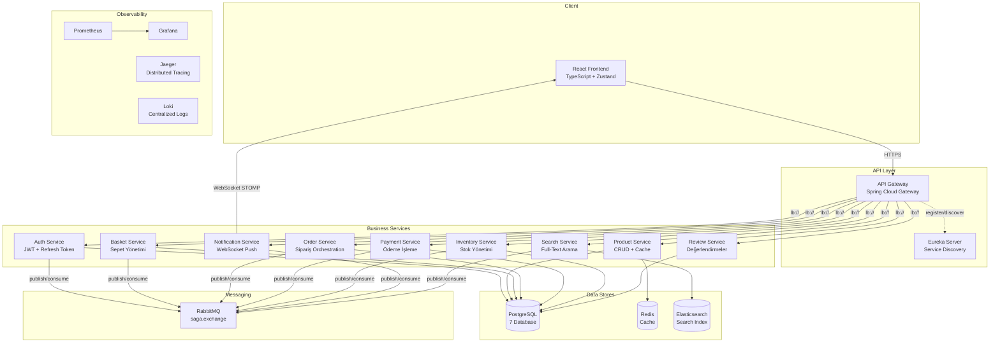

16 container, tek bir `docker-compose.yml` ile ayağa kalkıyor. Bunu başardığımda gerçekten gururlandım.

---

## Checkout Saga: En Çok Öğrendiğim Kısım

Projenin en zor ve en öğretici kısmı buydu. Bir kullanıcı sepetini onaylayınca arka planda 5 servis koordineli çalışıyor. Herhangi birinde hata olursa geri sarma (compensation) yapılması gerekiyor.

Buna **Saga Pattern** deniyor. Ben choreography yaklaşımını seçtim — merkezi bir orchestrator yok, servisler birbirlerine event fırlatarak haberleşiyor.

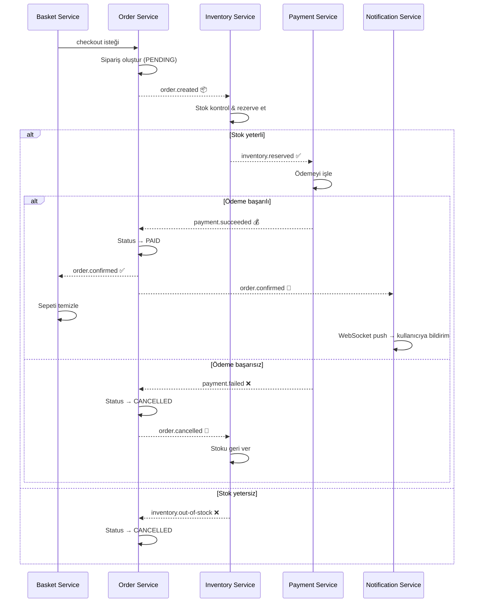

### Bunu Nasıl Implement Ettim?

Tüm event'ler tek bir RabbitMQ **topic exchange** üzerinden akıyor:

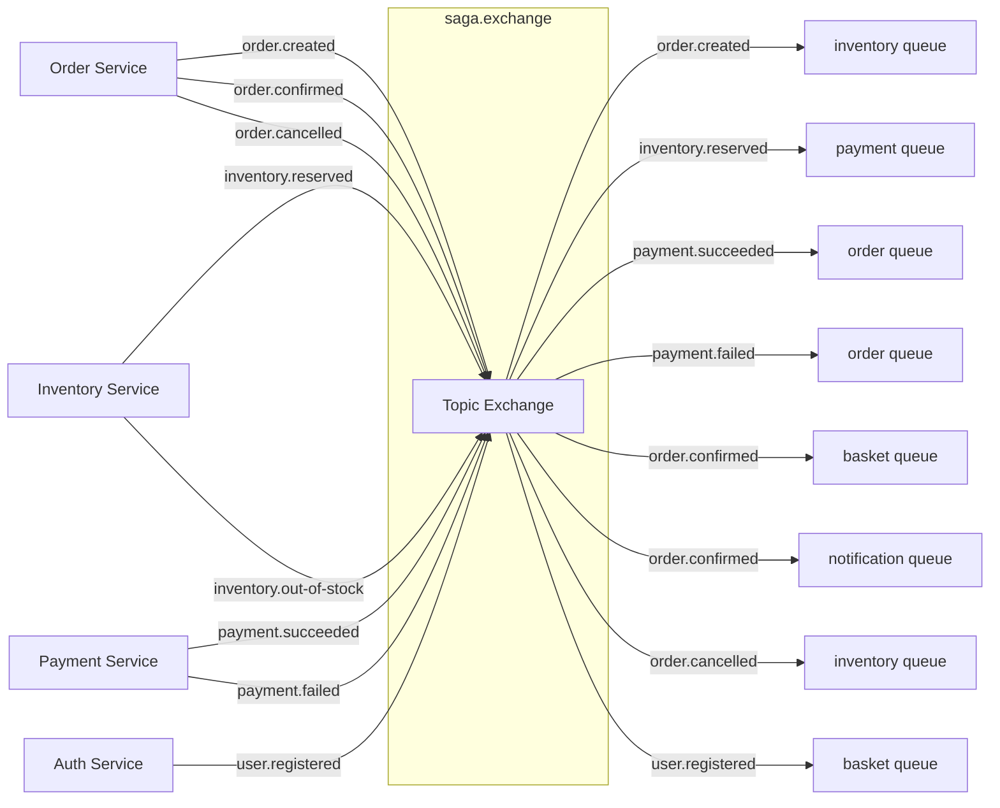

Her servis sadece kendi işini yapıyor, sonucu event olarak fırlatıyor. Kimse kimsenin iç detayını bilmiyor. İlk başta "bu kadar decoupled olmasına gerek var mı" diye düşündüm ama bir servisi değiştirdiğimde diğerlerinin hiç etkilenmediğini görünce anladım ki bu yaklaşım doğruymuş.

**Öğrendiğim en önemli şey:** Saga pattern'i observability olmadan debug etmek imkansız. İlk denememde bir event kayboldu, saatlerce log'lara baktım. Jaeger'ı entegre ettikten sonra trace'e bakıp 2 dakikada sorunu buldum.

---

## Kullanıcı Kayıt Saga'sı

Checkout kadar karmaşık olmayan ama yine event-driven olan ikinci saga:

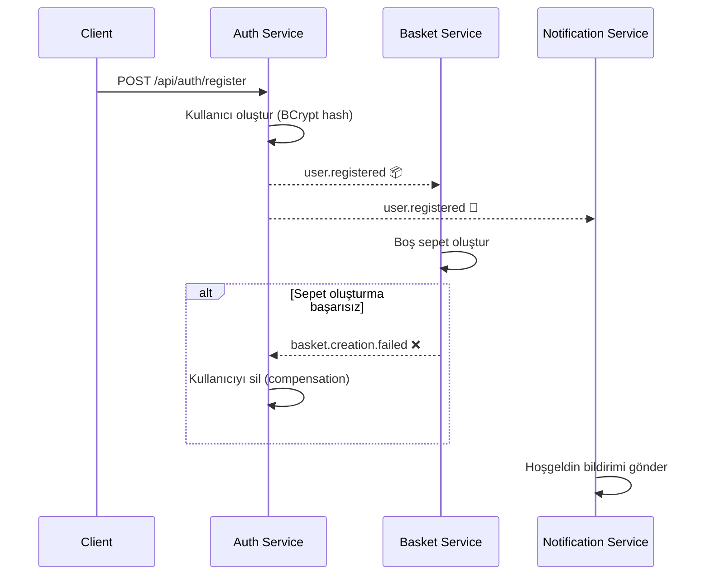

Burada compensation'ı ilk kez uyguladım. Sepet oluşturulamadığında auth-service kullanıcıyı geri siliyor. Distributed transaction'ın "ya hep ya hiç" mantığını event-driven şekilde sağlamış oluyoruz.

---

## JWT Güvenlik Akışı

Auth konusunda en çok refresh token rotation'ı implement etmeyi öğrendim. Access token 15 dakika sürüyor — süresi dolduğunda kullanıcı tekrar login olmak zorunda kalmasın diye refresh token kullanıyorum.

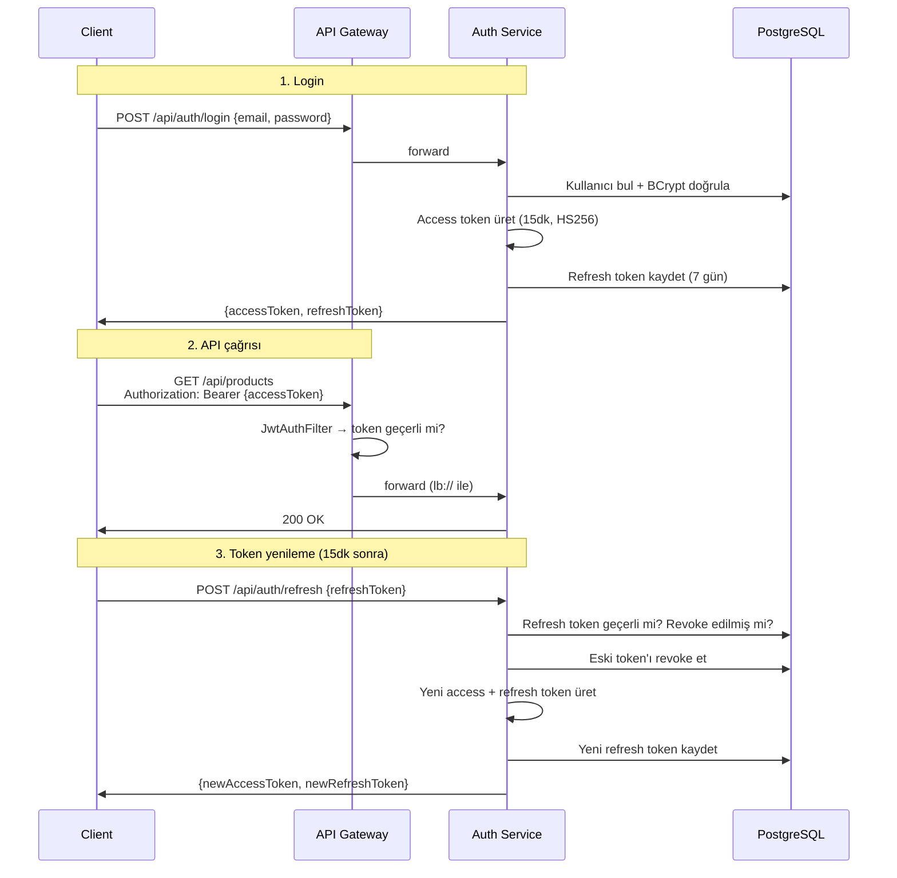

**Bucket4j ile rate limiting** de ekledim — auth endpoint'lerine dakikada 10 istek sınırı. Brute force saldırılarına karşı basit ama etkili bir önlem.

---

## Redis Cache Stratejisi

Product service'te her istek PostgreSQL'e gidiyordu ve yavaştı. Redis ekledikten sonra response süreleri 50ms'den 2ms'ye düştü.

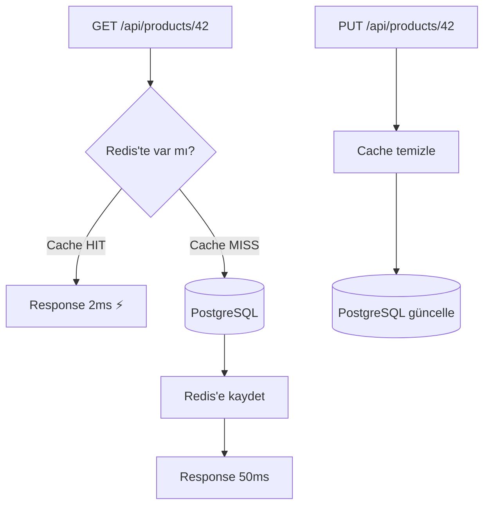

Farklı veri tipleri için farklı TTL'ler kullandım:

| Cache | TTL | Neden? |
|-------|-----|--------|
| Ürün (ID ile) | 30 dakika | Sık güncellenmez |
| Kategoriler | 24 saat | Neredeyse hiç değişmez |
| Arama sonuçları | 10 dakika | Sık değişebilir |

En önemli öğrendiğim şey: **Redis çökerse uygulama da çökmemeli.** Bunun için custom `CacheErrorHandler` yazdım — Redis erişilemezse log basıp DB'ye fallback yapıyor. İlk başta bunu yapmamıştım, Redis restart'ta tüm servis 500 veriyordu.

---

## CQRS: Yazma ve Okuma Modellerini Ayırmak

Ürün verileri PostgreSQL'de (write), arama için Elasticsearch'te (read) tutuluyor. Senkronizasyon RabbitMQ event'leri ile:

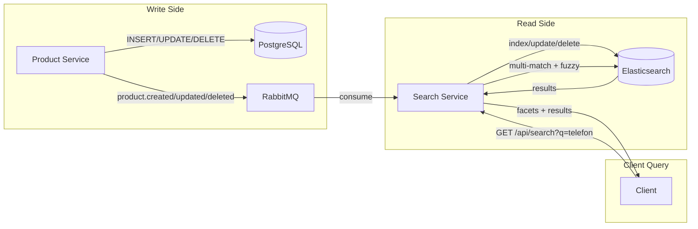

Elasticsearch'te **Türkçe analyzer** kullanıyorum — "telefonlar" yazınca "telefon" da buluyor. Fuzzy matching sayesinde "telfon" yazsan bile doğru sonuçlar geliyor.

---

## Observability: Hayat Kurtaran Üçlü

İlk başta observability'yi "gereksiz overhead" olarak görüyordum. İlk production bug'ında fikrimi değiştirdim.

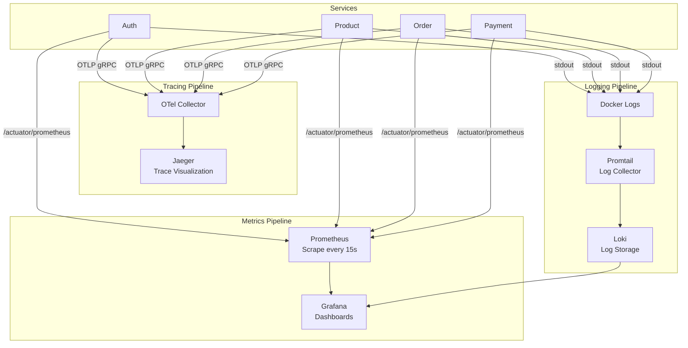

**Correlation ID** her request'te üretiliyor ve tüm servislere taşınıyor. Gateway'de başlıyor, her servisin log'unda görünüyor:

```
[correlationId=abc-123, traceId=def-456] OrderService - Sipariş oluşturuldu: #42
[correlationId=abc-123, traceId=def-456] InventoryService - Stok rezerve edildi: 3 adet
[correlationId=abc-123, traceId=def-456] PaymentService - Ödeme başarılı: 299.90 TRY
```

Bir sorun olduğunda correlation ID ile grep yapıyorum — tek bir request'in 8 servisteki yolculuğunu baştan sona görebiliyorum.

---

## WebSocket ile Gerçek Zamanlı Bildirimler

Sipariş onaylandığında kullanıcıya anında bildirim gitmesini istiyordum. Polling (sürekli istek atma) yerine **WebSocket** tercih ettim:

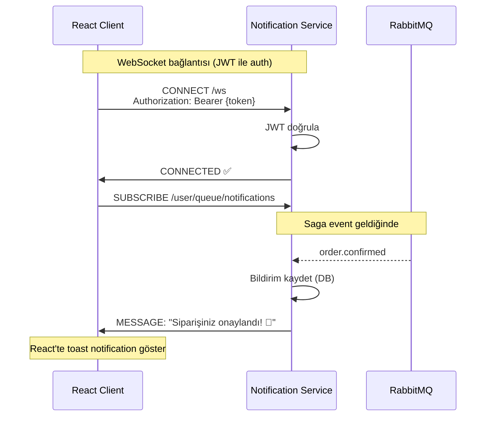

STOMP protokolü kullandım — her kullanıcı kendi queue'suna subscribe oluyor. Bir kullanıcının bildirimi başka kullanıcıya gitmiyor.

---

## Veritabanı Stratejisi: Her Servise Ayrı DB

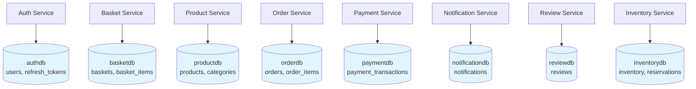

Her servis sadece kendi veritabanına erişiyor. Başka servisin verisine ihtiyaç varsa event ile alıyor, doğrudan DB'ye bağlanmıyor.

Schema yönetimi için **Flyway** kullanıyorum — `ddl-auto: update` yerine versiyonlanmış SQL migration'lar. Bootcamp'te hoca `ddl-auto: update` ile çalışıyordu, production'da ne kadar tehlikeli olduğunu araştırınca Flyway'e geçtim.

---

## Deploy: Tek Sunucu, 16 Container

Tüm sistemi **DigitalOcean** üzerinde 4 vCPU, 8 GB RAM bir sunucuya deploy ettim. GitHub Student Pack sayesinde $200 kredi ile 8 ay bedava.

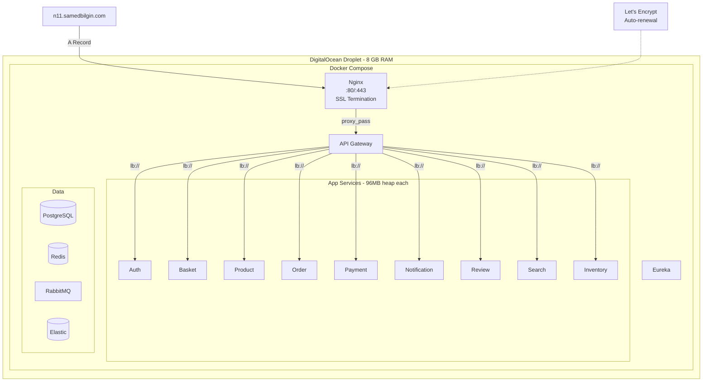

JVM heap'leri 96 MB'a düşürdüm, PostgreSQL'i tune ettim, observability stack'ı çıkardım — 3.1 GB'a sığdı. İlk başta 192 MB heap ile denedim, OOM killer tüm container'ları öldürdü. Swap eklemek de önemli bir ders oldu.

---

## Kullandığım Pattern'lerin Özeti

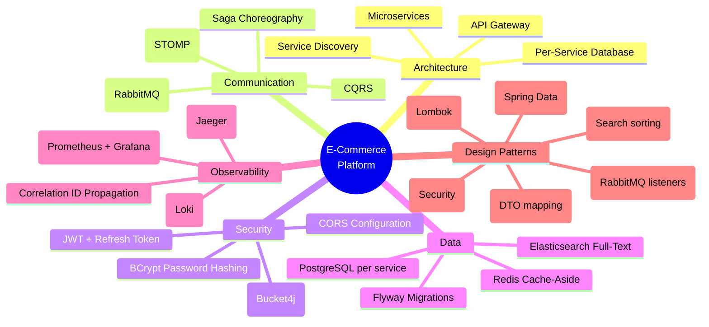

---

## Öğrendiğim 7 Şey

**1. Saga pattern'i debug etmek için observability şart.**
İlk denememde Jaeger yoktu. Bir event kaybolduğunda saatlerce baktım. Trace'ler olunca 2 dakikada buldum.

**2. Redis çökünce uygulama çökmemeli.**
CacheErrorHandler yazmayı unutmuştum. Redis restart'ta tüm product-service 500 verdi. Fallback mekanizması hayat kurtarıyor.

**3. `ddl-auto: update` production'da kullanılmaz.**
Bootcamp'te hep update kullandık. Araştırınca gördüm ki production'da kolon silinmesi, veri kaybı riski var. Flyway ile versiyonlanmış migration çok daha güvenli.

**4. Docker Compose küçük ölçekte yeterli.**
Kubernetes öğrenmeliyim diye stres yaptım ama 16 container'ı Compose ile gayet iyi yönettim. Health check + restart policy ile çoğu sorun kendini çözüyor.

**5. JVM heap tuning kritik.**
Default 256 MB heap ile 11 servis = 2.8 GB sadece heap. 96 MB'a düşürdüm, uygulama gayet çalışıyor. Micro-optimization öğrenmeden deploy yapmak tehlikeli.

**6. Correlation ID her yerde olmalı.**
Bir request'in 8 servisteki yolculuğunu izlemek için correlation ID şart. Gateway'de üretip header'da taşımak çok basit ama çok değerli.

**7. Hepsini bir arada görmek öğretiyor.**
Her pattern'i ayrı ayrı öğrenebilirsin ama birlikte çalıştıklarını görmek bambaşka bir deneyim. Cache invalidation'ın saga event'iyle nasıl tetiklendiğini, bir trace'in 8 servisi nasıl geçtiğini — bunları ancak end-to-end bir projede anlıyorsun.

---

## Tech Stack

| Katman | Teknoloji |
|--------|-----------|
| **Backend** | Java 21, Spring Boot 3.3, Spring Cloud Gateway |
| **Frontend** | React 18, TypeScript, Zustand, Tailwind CSS, Radix UI |
| **Database** | PostgreSQL 16, Redis 7, Elasticsearch 8.14 |
| **Messaging** | RabbitMQ 3.13 |
| **Security** | JWT (jjwt), BCrypt, Bucket4j |
| **Observability** | Prometheus, Grafana, Jaeger, Loki, OpenTelemetry |
| **Deploy** | Docker Compose, Nginx, Let's Encrypt, DigitalOcean |

---

*Sorularınız varsa yorumlarda yazın. Kodun tamamı GitHub'da açık — fork'layıp kendi projenize uyarlayabilirsiniz.*

**Etiketler:** #Microservices #SpringBoot #Java #Docker #SagaPattern #Redis #Elasticsearch #SystemDesign
