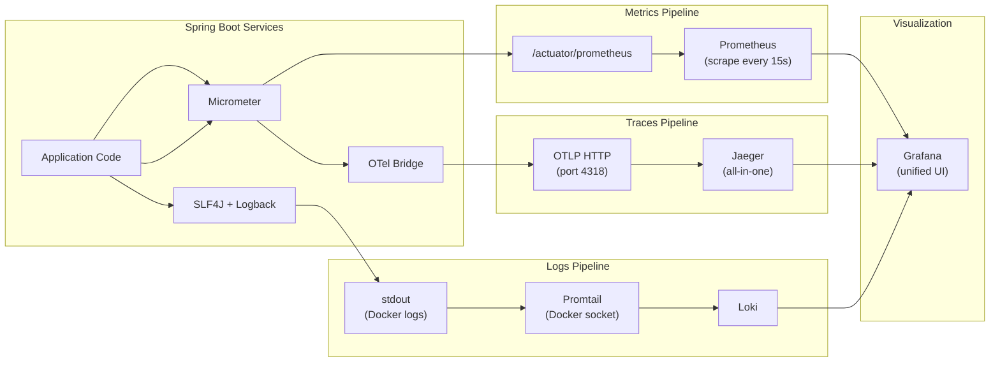
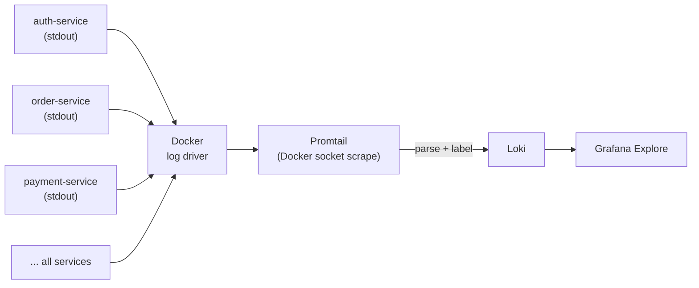
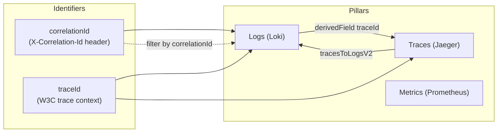

# Observability Stack

This document covers the three pillars of observability implemented in the project: **Metrics** (Prometheus + Grafana), **Traces** (OpenTelemetry + Jaeger), and **Logs** (Promtail + Loki + Grafana). All three are unified in Grafana with bidirectional cross-linking.

---

## Three Pillars Overview



---

## Metrics: Micrometer -> Prometheus -> Grafana

### How it works

1. Each Spring Boot service includes `micrometer-registry-prometheus`, which exposes a `/actuator/prometheus` endpoint in Prometheus exposition format.

2. Prometheus scrapes all 10 services (9 application services + gateway) every 15 seconds via static config targets.

3. A relabel rule extracts the service name from the target address:
   ```yaml
   relabel_configs:
     - source_labels: [__address__]
       target_label: service
       regex: '([^:]+):\d+'
       replacement: '$1'
   ```

4. Grafana queries Prometheus and renders the pre-provisioned dashboard.

### Prometheus Targets

| Target | Endpoint |
|--------|----------|
| `auth-service:8080` | `/actuator/prometheus` |
| `basket-service:8081` | `/actuator/prometheus` |
| `product-service:8082` | `/actuator/prometheus` |
| `order-service:8083` | `/actuator/prometheus` |
| `payment-service:8084` | `/actuator/prometheus` |
| `notification-service:8085` | `/actuator/prometheus` |
| `review-service:8086` | `/actuator/prometheus` |
| `search-service:8087` | `/actuator/prometheus` |
| `inventory-service:8088` | `/actuator/prometheus` |
| `api-gateway:8000` | `/actuator/prometheus` |

### Available Metric Families

Micrometer auto-instruments these categories:

| Category | Key Metrics |
|----------|-------------|
| HTTP Server | `http_server_requests_seconds_count`, `http_server_requests_seconds_sum`, `http_server_requests_seconds_bucket` |
| JVM Memory | `jvm_memory_used_bytes`, `jvm_memory_max_bytes`, `jvm_memory_committed_bytes` |
| JVM GC | `jvm_gc_pause_seconds_count`, `jvm_gc_pause_seconds_sum` |
| JVM Threads | `jvm_threads_live_threads`, `jvm_threads_daemon_threads` |
| DataSource | `hikaricp_connections_active`, `hikaricp_connections_idle` |
| Tomcat | `tomcat_sessions_active_current_sessions` |
| System | `process_cpu_usage`, `system_cpu_usage` |

### PromQL Examples

```promql
# Total request rate across all services (per second, 1-minute window)
sum(rate(http_server_requests_seconds_count{job="n11-services"}[1m])) by (service)

# 5xx error rate for order-service
sum(rate(http_server_requests_seconds_count{service="order-service", status=~"5.."}[1m]))

# P95 latency per service
histogram_quantile(0.95,
  sum(rate(http_server_requests_seconds_bucket{job="n11-services"}[5m])) by (service, le)
)

# P99 latency for checkout endpoint specifically
histogram_quantile(0.99,
  sum(rate(http_server_requests_seconds_bucket{service="order-service", uri="/api/orders/checkout"}[5m])) by (le)
)

# JVM heap usage per service (bytes)
sum(jvm_memory_used_bytes{area="heap", job="n11-services"}) by (service)

# HikariCP active connections
hikaricp_connections_active{job="n11-services"}

# Request count by HTTP status code
sum(increase(http_server_requests_seconds_count{job="n11-services"}[5m])) by (status)

# Number of services reporting "up"
count(up{job="n11-services"} == 1)
```

### Grafana Dashboard: "n11 -- Services Overview"

The pre-provisioned dashboard (`infra/grafana/dashboards/n11-overview.json`) contains 8 panels:

| Panel | Query Type | What it shows |
|-------|-----------|---------------|
| Total Requests/sec | Rate gauge | Aggregate request rate across all services |
| 5xx Errors/sec | Rate gauge | Server error rate |
| P95 Latency | Histogram quantile | 95th percentile response time |
| Request Rate by Service | Time series | Per-service request rate breakdown |
| P95 by Service | Time series | Per-service latency breakdown |
| JVM Heap Usage | Time series | Memory consumption per service |
| HTTP Status Distribution | Pie chart | 2xx / 4xx / 5xx proportions |
| Services Up | Stat panel | Count of healthy services |

Access it at: `http://localhost:13001` (login: `admin`/`admin`, or anonymous Viewer access).

---

## Traces: OpenTelemetry -> Jaeger

### How it works

1. Each service includes `micrometer-tracing-bridge-otel` and `opentelemetry-exporter-otlp`.

2. The bridge automatically instruments:
   - Spring Web (incoming HTTP requests)
   - RestClient / WebClient (outgoing HTTP calls)
   - RabbitTemplate (AMQP publish)
   - `@RabbitListener` (AMQP consume)
   - Spring Data JPA (database queries)

3. Spans are exported via OTLP HTTP to Jaeger at `http://jaeger:4318/v1/traces`.

4. Sampling is set to `1.0` (100%) for demo purposes. In production, lower this (e.g., `0.1`).

### Trace Context Propagation

Trace context flows automatically through:

- **HTTP headers** (W3C Trace Context `traceparent`/`tracestate`) -- from gateway to services
- **RabbitMQ message headers** -- the Micrometer instrumentation injects trace context into AMQP message properties, so a saga that spans multiple services via RabbitMQ appears as a single trace

### Example: Checkout Trace Waterfall

When a user checks out, Jaeger shows this trace:

```
api-gateway
  POST /api/orders/checkout (5ms)
    order-service
      POST /api/orders/checkout (430ms)
        RabbitMQ publish: order.created
          inventory-service
            AMQP consume: order.created (15ms)
              PostgreSQL: SELECT inventory_items
              PostgreSQL: UPDATE inventory_items
              PostgreSQL: INSERT reservations
              RabbitMQ publish: inventory.reserved
                payment-service
                  AMQP consume: inventory.reserved (8ms)
                    PostgreSQL: INSERT payment_transactions
                    RabbitMQ publish: payment.succeeded
                      order-service
                        AMQP consume: payment.succeeded (5ms)
                          PostgreSQL: UPDATE orders SET status=PAID
                          RabbitMQ publish: order.confirmed
                            basket-service
                              AMQP consume: order.confirmed (3ms)
                            notification-service
                              AMQP consume: order.confirmed (2ms)
```

### How to View Traces

1. Open Jaeger UI: `http://localhost:26686`
2. Select **Service**: `order-service`
3. Select **Operation**: `POST /api/orders/checkout`
4. Click **Find Traces**
5. Open the most recent trace
6. The timeline view shows the full saga flow with timing

### Trace Environment Variables

| Variable | Value | Set by |
|----------|-------|--------|
| `MANAGEMENT_TRACING_SAMPLING_PROBABILITY` | `1.0` | docker-compose.yml |
| `MANAGEMENT_OTLP_TRACING_ENDPOINT` | `http://jaeger:4318/v1/traces` | docker-compose.yml |

---

## Logs: Promtail -> Loki -> Grafana

### How it works



1. Services log to stdout using Spring Boot's default Logback console appender.

2. Promtail connects to the Docker socket and reads container logs directly. No log driver reconfiguration needed on the services.

3. Promtail parses the Spring Boot log pattern and extracts labels:
   ```
   2026-04-22 14:23:45.678 INFO  [b4a9...,1a2b3c...] com.example.order.OrderController - message
   ```

4. Extracted labels: `level`, `correlationId`, `traceId`, `service` (from container name).

5. Infrastructure containers (postgres, rabbitmq, elasticsearch, etc.) are dropped by Promtail's relabel rules to reduce noise.

### Log Line Format

Every service uses the `RequestLoggingFilter` to log two lines per HTTP request:

```
2026-04-22 14:23:45.678 INFO  [correlationId,traceId] logger - -> POST /api/orders/checkout
2026-04-22 14:23:46.112 INFO  [correlationId,traceId] logger - <- POST /api/orders/checkout status=202 | 434 ms
```

The bracketed values:
- **correlationId** -- Assigned by `RequestLoggingFilter` from the `X-Correlation-Id` header (or generated as UUID). Propagated to downstream services via the gateway. Returned in the response header.
- **traceId** -- Injected into MDC by the Micrometer tracing bridge. Same as the Jaeger span ID.

### Promtail Pipeline

The Promtail config (`infra/promtail/promtail-config.yaml`) uses:

1. **Docker service discovery** (`docker_sd_configs`) -- auto-discovers running containers
2. **Relabel** -- extracts `service` label from compose service name, drops infra containers
3. **Regex pipeline stage** -- parses the Spring Boot log pattern into structured labels
4. **Labels stage** -- promotes `level`, `correlationId`, `traceId` to Loki index labels

### LogQL Examples

```logql
# All logs from order-service
{service="order-service"}

# Only errors from any service
{job="docker", level="ERROR"}

# All logs for a specific request (across all services)
{correlationId="b4a9f1e2-..."}

# All logs for a specific distributed trace
{traceId="1a2b3c4d5e6f..."}

# Checkout requests only
{service="order-service"} |= "/api/orders/checkout"

# Payment failures
{service="payment-service"} |= "FAILED"

# Slow requests (response time > 1000ms) -- requires log line parsing
{service="order-service"} | regexp `(?P<duration>\d+) ms$` | duration > 1000

# Count errors per service in the last hour
sum(count_over_time({level="ERROR"}[1h])) by (service)

# Rate of 5xx log lines
sum(rate({level="ERROR"}[5m])) by (service)
```

---

## Cross-Pillar Correlation

The three pillars are connected through shared identifiers, enabling **bidirectional click-through** in Grafana:



### Loki -> Jaeger (log to trace)

The Loki datasource in Grafana has a `derivedFields` configuration:

```yaml
derivedFields:
  - name: TraceID
    matcherRegex: "traceId=([a-f0-9]+)"
    url: "$${__value.raw}"
    datasourceUid: jaeger
```

When viewing a log line in Grafana Explore, the traceId is rendered as a clickable link that opens the corresponding trace in Jaeger.

### Jaeger -> Loki (trace to logs)

The Jaeger datasource has `tracesToLogsV2` configured:

```yaml
tracesToLogsV2:
  datasourceUid: loki
  tags: [{ key: 'traceId', value: 'traceId' }]
  filterByTraceID: true
```

When viewing a trace in Grafana's Jaeger panel, clicking the "Logs" icon on a span queries Loki for all log lines with that traceId.

---

## Debugging a Request End-to-End

Here is a step-by-step guide for debugging a slow or failing checkout request:

### Step 1: Get the Correlation ID

Every API response includes the `X-Correlation-Id` header:

```bash
curl -v -X POST http://localhost:18000/api/orders/checkout \
  -H "Authorization: Bearer <token>" \
  -H "Content-Type: application/json" \
  -d '{"shippingAddress": "...", "items": [...]}'

# Look for: < X-Correlation-Id: a1b2c3d4-...
```

### Step 2: Find All Logs for This Request

Open Grafana Explore (`http://localhost:13001/explore`), select Loki datasource:

```logql
{correlationId="a1b2c3d4-..."}
```

This shows every log line from every service that participated in handling this request.

### Step 3: Jump to the Trace

In the log results, find the entry log line from `order-service`. The `traceId` in brackets is a clickable link (via derivedFields). Click it to open the Jaeger trace view.

### Step 4: Analyze the Trace

The waterfall view shows:
- Total saga duration
- Time spent in each service
- Time spent in database queries
- Time spent waiting for RabbitMQ delivery
- Which step failed (if any)

### Step 5: Check Metrics for Patterns

If the issue is systemic (not just one request), check Grafana dashboards:

```promql
# Is the service under heavy load?
rate(http_server_requests_seconds_count{service="order-service"}[5m])

# Are there memory pressure issues?
jvm_memory_used_bytes{service="order-service", area="heap"}

# Is the connection pool saturated?
hikaricp_connections_active{service="order-service"}
```

---

## Grafana Datasource Configuration

All datasources are auto-provisioned via `infra/grafana/provisioning/datasources/datasources.yml`:

| Datasource | Type | URL | Notes |
|-----------|------|-----|-------|
| Prometheus | `prometheus` | `http://prometheus:9090` | Default datasource |
| Jaeger | `jaeger` | `http://jaeger:16686` | With tracesToLogsV2 linking |
| Loki | `loki` | `http://loki:3100` | With derivedFields for trace linking |

---

## Configuration Reference

### Service-level (docker-compose.yml)

| Variable | Value |
|----------|-------|
| `MANAGEMENT_TRACING_SAMPLING_PROBABILITY` | `1.0` |
| `MANAGEMENT_OTLP_TRACING_ENDPOINT` | `http://jaeger:4318/v1/traces` |

### Prometheus

| Setting | Value |
|---------|-------|
| Scrape interval | `15s` |
| Evaluation interval | `15s` |
| Retention | `3d` |

### Loki

| Setting | Value |
|---------|-------|
| Listen port | `3100` |
| Storage | Local filesystem (`/loki`) |

### Grafana

| Setting | Value |
|---------|-------|
| Admin credentials | `admin` / `admin` |
| Anonymous access | Enabled (Viewer role) |
| Dashboards | Auto-provisioned from `infra/grafana/dashboards/` |

---

## Production Considerations

| Concern | Demo Config | Production Recommendation |
|---------|------------|--------------------------|
| Trace sampling | 100% (`1.0`) | 10-20% (`0.1` - `0.2`) |
| Prometheus retention | 3 days | Use remote write to long-term storage (Thanos, Cortex) |
| Loki storage | Local filesystem | S3/GCS backend |
| Grafana auth | Anonymous Viewer + admin/admin | SSO / LDAP integration |
| Jaeger storage | In-memory (all-in-one) | Elasticsearch or Cassandra backend |
| Alerting | None configured | Grafana alerting rules for error rates, latency thresholds |

---

## Related Documentation

- [Architecture](architecture.md) -- How services are structured and connected
- [Saga Patterns](saga-patterns.md) -- What the traces are actually showing
- [Deployment](deployment.md) -- Docker Compose infrastructure configuration
