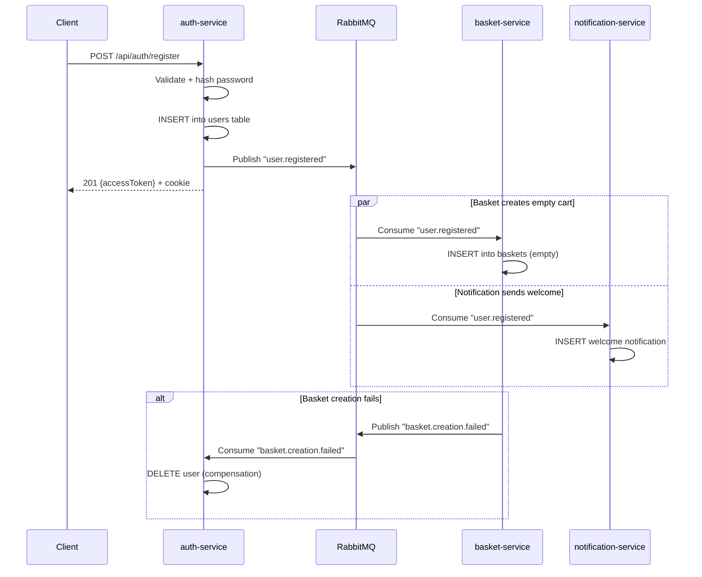
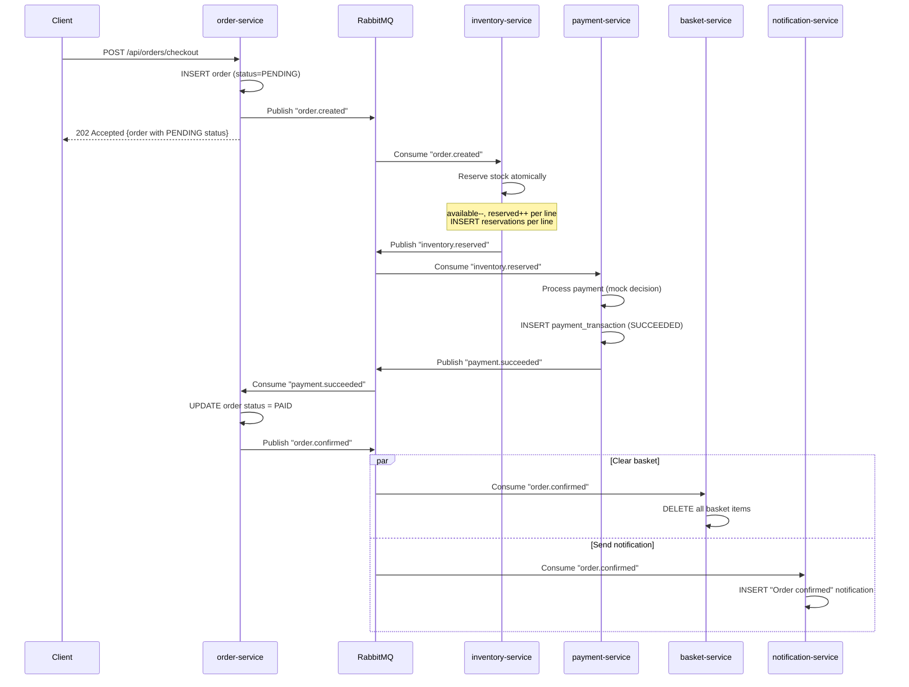
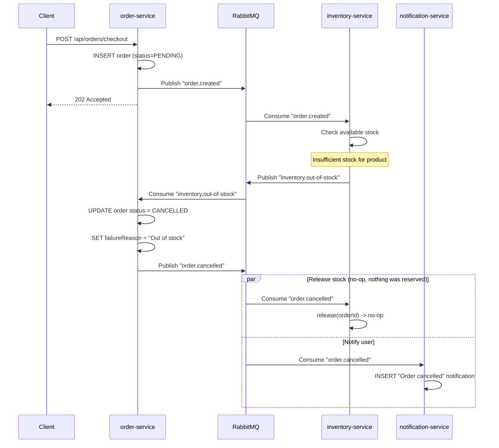
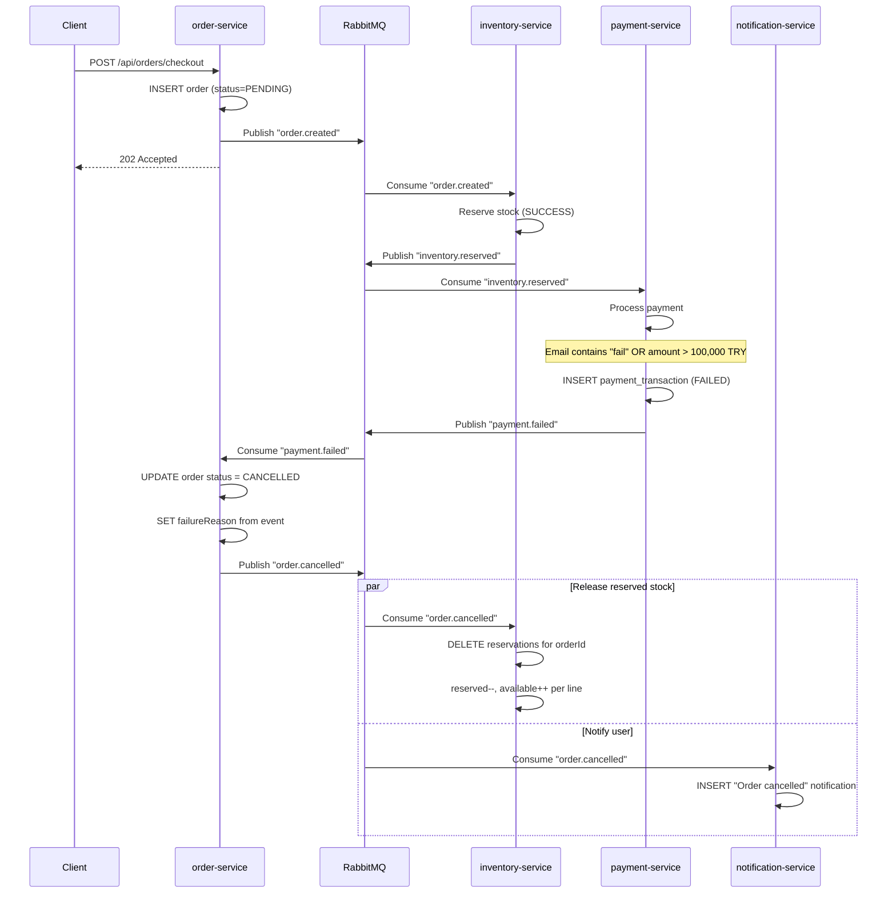
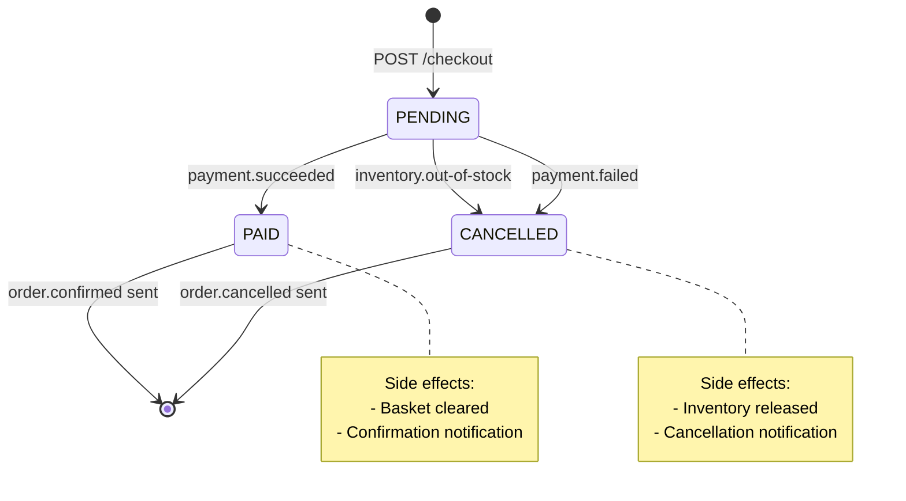
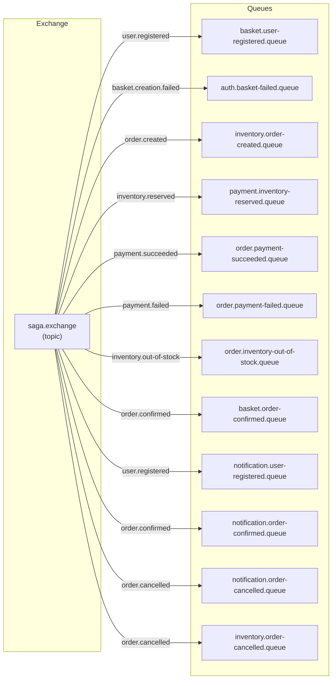

# Saga Choreography Patterns

This document explains the distributed transaction patterns used in the project: how sagas work, why choreography was chosen over orchestration, the detailed event flows for both the UserRegistrationSaga and the CheckoutSaga, the RabbitMQ topology, event contracts, and idempotency rules.

---

## What Is a Saga?

A saga is a sequence of local transactions across multiple services. Each service executes its own transaction and publishes an event. If a step fails, previously completed steps are undone through **compensating transactions**. Unlike a distributed 2PC (two-phase commit), sagas never hold locks across services.

### Why Choreography Over Orchestration?

| Aspect | Choreography (this project) | Orchestration |
|--------|---------------------------|---------------|
| Coordination | Each service reacts to events autonomously | Central orchestrator directs each step |
| Coupling | Low -- services only know about events, not each other | Higher -- orchestrator knows all services |
| Single point of failure | None | Orchestrator |
| Complexity location | Distributed across listeners | Centralized in orchestrator |
| Best for | Simple linear flows (2-5 steps) | Complex flows with branching logic |

This project uses choreography because the flows are linear and each service has clear responsibility boundaries. The trade-off (harder to trace the flow) is mitigated by the observability stack -- Jaeger shows the entire saga as a single distributed trace.

---

## UserRegistrationSaga

Ensures that when a user registers, an empty shopping basket is created automatically. If basket creation fails, the user is deleted (compensation).



### Event Details

**user.registered** (auth -> basket, notification):

| Field | Type | Description |
|-------|------|-------------|
| `eventId` | `String` | UUID, unique per event instance |
| `occurredAt` | `Instant` | Timestamp of event creation |
| `userId` | `Long` | Database ID of the new user |
| `email` | `String` | User's email address |
| `fullName` | `String` | User's full name |

**basket.creation.failed** (basket -> auth):

| Field | Type | Description |
|-------|------|-------------|
| `eventId` | `String` | UUID |
| `occurredAt` | `Instant` | Timestamp |
| `userId` | `Long` | ID of the user whose basket failed |
| `email` | `String` | User's email |
| `reason` | `String` | Failure description |

---

## CheckoutSaga

The checkout saga is the core distributed transaction of the platform. It coordinates order creation, inventory reservation, payment processing, basket clearing, and notification delivery across five services.

### Happy Path



### Failure Path: Inventory Out of Stock



### Failure Path: Payment Declined



---

## Complete Checkout Saga State Machine



---

## Mock Payment Decision Logic

The `payment-service` uses a deterministic mock to make payment accept/reject testable:

| Condition | Result | How to trigger |
|-----------|--------|---------------|
| User email contains `"fail"` | FAILED | Register as `failuser@n11demo.com` |
| Total amount > 100,000 TRY | FAILED | Add expensive items to cart |
| Amount = 100,000 TRY exactly | SUCCEEDED | Boundary -- passes |
| All other cases | SUCCEEDED | Normal checkout |

---

## RabbitMQ Topology

All saga events flow through a single **topic exchange**.



### Routing Key Reference

| Routing Key | Publisher | Consumer(s) |
|-------------|----------|-------------|
| `user.registered` | auth-service | basket-service, notification-service |
| `basket.creation.failed` | basket-service | auth-service |
| `order.created` | order-service | inventory-service |
| `inventory.reserved` | inventory-service | payment-service |
| `inventory.out-of-stock` | inventory-service | order-service |
| `payment.succeeded` | payment-service | order-service |
| `payment.failed` | payment-service | order-service |
| `order.confirmed` | order-service | basket-service, notification-service |
| `order.cancelled` | order-service | inventory-service, notification-service |

### Queue Naming Convention

Queues follow the pattern: `{owning-service}.{event-name}.queue`

This makes it immediately clear which service owns the queue and what event it processes when inspecting RabbitMQ management UI.

---

## Event Contracts

Each event is a Java `record` implementing `Serializable`. Events carry all the data downstream consumers need -- no callbacks to the publishing service required.

### Common Fields (all events)

| Field | Type | Description |
|-------|------|-------------|
| `eventId` | `String` | UUID -- unique identifier for idempotency |
| `occurredAt` | `Instant` | When the event was created |

### UserRegisteredEvent

| Field | Type |
|-------|------|
| `userId` | `Long` |
| `email` | `String` |
| `fullName` | `String` |

### BasketCreationFailedEvent

| Field | Type |
|-------|------|
| `userId` | `Long` |
| `email` | `String` |
| `reason` | `String` |

### OrderCreatedEvent

| Field | Type |
|-------|------|
| `orderId` | `Long` |
| `userEmail` | `String` |
| `totalAmount` | `BigDecimal` |
| `items` | `List<Line>` |
| `items[].productId` | `Long` |
| `items[].quantity` | `int` |

### InventoryReservedEvent

| Field | Type |
|-------|------|
| `orderId` | `Long` |
| `userEmail` | `String` |
| `totalAmount` | `BigDecimal` |

### InventoryOutOfStockEvent

| Field | Type |
|-------|------|
| `orderId` | `Long` |
| `userEmail` | `String` |
| `missingProductId` | `Long` |
| `requestedQuantity` | `int` |
| `reason` | `String` |

### PaymentSucceededEvent

| Field | Type |
|-------|------|
| `orderId` | `Long` |
| `userEmail` | `String` |
| `amount` | `BigDecimal` |
| `transactionId` | `String` |

### PaymentFailedEvent

| Field | Type |
|-------|------|
| `orderId` | `Long` |
| `userEmail` | `String` |
| `reason` | `String` |

### OrderConfirmedEvent

| Field | Type |
|-------|------|
| `orderId` | `Long` |
| `userEmail` | `String` |
| `totalAmount` | `BigDecimal` |

### OrderCancelledEvent

| Field | Type |
|-------|------|
| `orderId` | `Long` |
| `userEmail` | `String` |
| `reason` | `String` |

---

## Idempotency Rules

In a distributed system, messages can be delivered more than once (at-least-once delivery). Each consumer is designed to handle duplicates safely:

| Consumer | Idempotency Strategy |
|----------|---------------------|
| basket-service `onUserRegistered` | `createEmptyBasketFor` checks if basket already exists for email -- no-op if so |
| basket-service `onOrderConfirmed` | Clearing an already-empty basket is a no-op |
| inventory-service `onOrderCreated` | Reservation is atomic per orderId; if reservations already exist, the service can detect this |
| inventory-service `onOrderCancelled` | `release(orderId)` deletes reservations and restores stock; if no reservations exist, it is a no-op |
| order-service `onPaymentSucceeded` | Finds order by ID; if already PAID, no state change occurs |
| order-service `onPaymentFailed` | Finds order by ID; if already CANCELLED, no state change occurs |
| notification-service | Notifications are additive; duplicate delivery creates a duplicate notification (acceptable for this use case) |
| auth-service `onBasketCreationFailed` | Deletes user by ID; if user doesn't exist, no-op |

### Event ID

Every event carries a `UUID eventId`. While the current implementation relies on business-level idempotency (checking database state), the eventId field provides a foundation for implementing deduplication tables (outbox pattern) if needed in the future.

---

## Observing Sagas in Action

### From the browser

1. **Happy path**: Register, add items to cart, checkout at `/checkout`. Poll the order detail page -- status transitions from `PENDING` to `PAID` within seconds. A confirmation notification appears.

2. **Payment failure**: Log in as `failuser@n11demo.com` and checkout. The order transitions to `CANCELLED` with the failure reason. A cancellation notification appears.

3. **Stock failure**: Add more items than available stock and checkout. Same `CANCELLED` result with stock-related reason.

### From Jaeger

Open Jaeger UI at `http://localhost:26686`, select `order-service`, and find the checkout trace. The waterfall view shows every hop:

```
order-service (HTTP POST /checkout)
  -> RabbitMQ publish order.created
    -> inventory-service (AMQP consume)
      -> PostgreSQL reserve
      -> RabbitMQ publish inventory.reserved
        -> payment-service (AMQP consume)
          -> RabbitMQ publish payment.succeeded
            -> order-service (AMQP consume)
              -> RabbitMQ publish order.confirmed
                -> basket-service (AMQP consume)
                -> notification-service (AMQP consume)
```

### From Grafana Logs

Query Loki with the correlationId from the checkout response header:

```logql
{correlationId="<value-from-X-Correlation-Id-header>"}
```

This shows every log line across all services involved in that specific saga execution.

---

## Related Documentation

- [Architecture](architecture.md) -- Service communication patterns
- [Observability](observability.md) -- How to trace saga flows end-to-end
- [API Reference](api-reference.md) -- Checkout endpoint details
- [Data Model](data-model.md) -- Entity schemas for orders, payments, inventory
